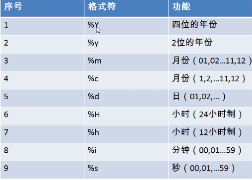
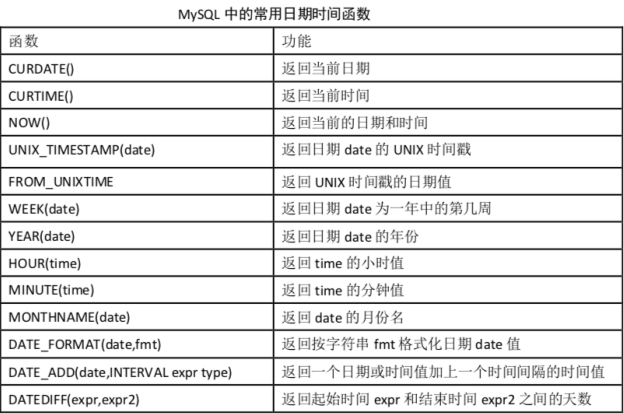

# MySQL基础

## 1. 数据库常见概念

### 1.DB

> DB：数据库(database ),存储数据的“仓库”。它保存了一系列有组织的数据。

### 2.DBMS

> DBMS：数据库管理系统(Database Management System )。数据库是通过 DBMS 创建和操作的容器

### 3.SQL

> SQL：结构化查询语言(Structure Query Language ),专门用来与数据库通信的语言。不是某个数据库软件特有的，而是几乎所有的主流数据库软件通用的语言

## 2. MySQL启动和停止

### 1.mysql启动

+ windows下

  ```mysql
  net start mysql(服务名)
  ```

+ linux下

  ```mysql
  service mysql start
  ```

### 2.mysql停止

+  windows下

  ```mysql
  net stop mysql(服务名)
  ```

+ linux下

  ```mysql
  service mysql stop
  ```

## 3. MySQL登录和退出

### 1.mysql登录

```mysql
语法： mysql -h 主机名 -P 端口号 -u 用户名 -p 密码
例子： mysql -h localhost -u root -p******
```

### 2.mysql退出

```mysql
exit或者ctrl+C
```

## 4. 注释

```
# 这是单行注释部分
-- 这是单行注释部分
/* 这是多行注释部分 */
```

## 5.常见的sql

### 1.查看所有库

```mysql 
show databases;
```

### 2.打开指定的库

```mysql
use 数据库名;
```

### 3.查看所有表

```mysql
show tables;
```

### 4.查看某库的所有表

```mysql
show tables from 某库名;
```

### 5.查看表结构

```mysql
desc 表名;
```

### 6.查看MySQL版本

```mysql
select version();
```

### 7.终端查看MySQL版本

```mysql
方式一：mysql --version
方式二：mysql -V
```

## 6.DDL

> DDL:数据定义语言

```mysql
库和表的管理
	库的管理：创建、修改、删除
	表的修改：创建、修改、删除
创建： create
修改： alter
删除： drop
```

### 1.库的管理

+ 创建数据库

  ```mysql
  语法：
  	create database [if not exists] `数据库名` charset=字符编码(utf8);
  例子:
  	1.创建库Books
  	create database if not exists books charset=utf8;
  ```

+ 修改数据库

  > 修改数据库名(很少)，都是修改数据库的字符集

  ```mysql
  语法: 
  	alter database 库名 charset 字符集名;
  例子：
  	1.更改库的字符集
  	alter database books charset gbk;
  ```

+ 删除数据库

  ```mysql
  语法：
  	drop database [if exists] 库名;
  例子：
  	1.库的删除
  	drop database if exists books;
  ```

  

+ 查看数据库

  ```mysql
  show databases;
  ```

+ 选择数据库 

  ```mysql
  use 数据库名;
  ```

### 2.表的管理

+ 创建表

  ```mysql
  语法：
      create table [if not exists] 表名(
          字段名 字段类型 [(长度) 约束],
          字段名 字段类型 [(长度) 约束],
          。。。
          字段名 字段类型 [(长度) 约束] 
      )
  例子：
  	1.创建表Book
  	create table book(
          id int,#编号
          bName varchar(20),#图书名
          price double,#价格
          authorId  int,#作者编号
          publishDate datetime#出版日期
  	);
  	2.创建表author
      create table if not exists author(
          id int,
          au_name varchar(20),
          nation varchar(10)
      );
  ```

+ 修改表

  ```mysql
  语法：
  	alter table 表名 add|drop|modify|change column 列名 [列类型 约束];
  ```

  + 添加列

    ```mysql
    例子：
    	 alter table author add column annual double; 
    ```

  + 修改列的类型或约束

    ```mysql
    例子：
    	alter table book modify column pubdate timestamp;
    ```

  + 修改列名

    ```mysql
    例子：
    	alter table book change column publishdate pubDate datetime;
    ```

  + 删除列

    ```mysql
    例子：
    	alter table book_author drop column  annual;
    ```

  + 修改表名

    ```mysql
    例子：
    	alter table author rename to book_author;
    ```

+ 删除表

  ```mysql
  drop table if exists book_author;
  ```

+ 复制表

  + 复制表的结构

    ```mysql
    create table copy like author;
    ```

  + 复制表的结构+数据

    ```mysql
    create table copy2 select * from author;
    ```

  + 只复制部分数据

    ```mysql
    create table copy3 select id,au_name from author  where nation='中国';
    ```

  + 仅仅复制某些字段

    ```mysql
    create table copy4 select id,au_name from author where 0;
    ```

+ 查看表

  ```mysql
  show tables;
  ```

+ 显示表结构

  ```mysql
  desc 表名;
  ```

  

### 3.数据类型

```mysql
数值型：
	整型
	小数：定点数、浮点数
字符型：
	较短的文本：char、varchar
	较长的文本：text、blob（较长的二进制数据）
日期型：
```

#### 1.整型

+ 概念

  ```mysql
  分类：
  tinyint、smallint、mediumint、int/integer、bigint
  1	 		2			3		4			8
  特点：
  ① 如果不设置无符号还是有符号，默认是有符号，如果想设置无符号，需要添加unsigned关键字
  ② 如果插入的数值超出了整型的范围,会报out of range异常，并且插入临界值
  ③ 如果不设置长度，会有默认的长度
  长度代表了显示的最大宽度，如果不够会用0在左边填充，但必须搭配zerofill使用！zerofill也表示是无符号数
  ```

+ 例子

  ```mysql
  1.如何设置无符号和有符号
      create table tab_int(
          t1 int(7) ZEROFILL,
          t2 int(7) ZEROFILL 
      );
  2.
  ```

#### 2.小数

+ 概念

  ```mysql
  分类：
      1.浮点型
          float(M,D)
          double(M,D)
      2.定点型
          dec(M，D)
          decimal(M,D)
  
  特点：
      ①
      M：整数部位+小数部位
      D：小数部位
      如果超过范围，则插入临界值
      ②
      M和D都可以省略
      如果是decimal，则M默认为10，D默认为0
      如果是float和double，则会根据插入的数值的精度来决定精度
      ③定点型的精确度较高，如果要求插入数值的精度较高如货币运算等则考虑使用
  ```

+ 例子

  ```mysql
  1.测试M和D
  create table tab_float(
  	f1 float,
  	f2 double,
  	f3 decimal
  );
  ```

+ 原则

  > 所选择的类型越简单越好，能保存数值的类型越小越好

#### 3.字符型

+ 概念

  ```mysql
  较短的文本： char、 varchar
  其他：
      binary和 varbinary用于保存较短的二进制
      enum用于保存枚举
      set用于保存集合
  较长的文本： text、 blob(较大的二进制)
  特点：
  		写法		M的意思		 				特点			空间的耗费	效率
  char	char(M)		最大的字符数，可以省略，默认为1  固定长度的字符  比较耗费	  	高
  varchar varchar(M)	最大的字符数，不可以省略	    可变长度的字符  比较节省	  低
  ```

+ 例子

  ```mysql
  1.枚举类型 enum 只能选一个记录
      create table tab_set(
          s1 enum('a','b','c')
      );
  2.集合类型 set 可以选多个记录
      create table tab_set(
          s1 set('a','b','c')
      );
  ```

#### 4.日期型

+ 概念

  ```mysql
  分类：
      date只保存日期
      time 只保存时间
      year只保存年
      datetime保存日期+时间
      timestamp保存日期+时间
  特点：
  			字节		范围			时区等的影响
  datetime	8		1000——9999	  不受
  timestamp	4	    1970-2038	  受
  ```

+ 例子

  ```mysql
  create table tab_date(
  	t1 datetime,
  	t2 timestamp
  );
  ```

### 4.常见的约束

> 约束：一种限制，用于限制表中的数据，为了保证表中的数据的准确和可靠性

```mysql
分类：六大约束
	not null：非空，用于保证该字段的值不能为空
	比如姓名、学号等
	default:默认，用于保证该字段有默认值。比如性别
	primary key:主键，用于保证该字段的值具有唯一性，并且非空。比如学号、员工编号等
	unique:唯一，用于保证该字段的值具有唯一性，可以为空。比如座位号
	check:检查约束【mysql中不支持】,比如年龄、性别
	foreign key:外键，用于限制两个表的关系，用于保证该字段的值必须来自于主表的关联列的值
		在从表添加外键约束，用于引用主表中某列的值。比如学生表的专业编号，员工表的部门编号，员工表的工种编号
添加约束的时机：1.创建表时 2.修改表时
约束的添加分类：
	列级约束：
		六大约束语法上都支持，但外键约束没有效果		
	表级约束：	
		除了非空、默认，其他的都支持		
主键和唯一的大对比：
		保证唯一性  是否允许为空    一个表中可以有多少个   是否允许组合
	主键	√			×			至多有1个           √，但不推荐
	唯一	√			√			可以有多个          √，但不推荐
外键：
	1、要求在从表设置外键关系
	2、从表的外键列的类型和主表的关联列的类型要求一致或兼容，名称无要求
	3、主表的关联列必须是一个key（一般是主键或唯一）
	4、插入数据时，先插入主表，再插入从表
	删除数据时，先删除从表，再删除主表
```

#### 1.创建表时添加约束

+ 添加列级约束

  + 语法

    ```mysql
    直接在字段名和类型后面追加 约束类型即可。
    只支持：默认、非空、主键、唯一
    ```

  + 例子

    ```mysql
    create table stuinfo(
    	id int primary key,#主键
    	stuName varchar(20) not null unique,#非空
    	gender char(1) check(gender='男' or gender ='女'),#检查
    	seat int unique,#唯一
    	age int default  18,#默认约束
    	majorId int references major(id)#外键
    );
    查看stuinfo中的所有索引，包括主键、外键、唯一
  show index from stuinfo;
    ```
    

+ 添加表级约束

  + 语法

    ```mysql
    语法：在各个字段的最下面
     [constraint 约束名] 约束类型(字段名) 
    ```

  + 例子

    ```mysql
    create table stuinfo(
    	id int,
	stuname varchar(20),
    	gender char(1),
    	seat int,
    	age int,
    	majorid int,
    	
    	constraint pk primary key(id),#主键
    	constraint uq unique(seat),#唯一键
    	constraint ck check(gender ='男' or gender  = '女'),#检查
    	constraint fk_stuinfo_major foreign key(majorid) references major(id)#外键	
    );
    ```
    
  + 通用的写法 ★
  
    ```mysql
    create table if not exists stuinfo(
    	id int primary key,
    	stuname varchar(20),
    	sex char(1),
    	age int default 18,
    	seat int unique,
    	majorid int,
    	constraint fk_stuinfo_major foreign key(majorid) references major(id)
    );
    ```

#### 2.修改表时添加约束

+ 语法

  ```mysql
  1、添加列级约束
  alter table 表名 modify column 字段名 字段类型 新约束;
  
  2、添加表级约束
  alter table 表名 add [constraint 约束名] 约束类型(字段名) [外键的引用];
  ```

+ 例子

  ```mysql
  drop table if exists stuinfo;
  create table stuinfo(
  	id int,
  	stuname varchar(20),
  	gender char(1),
  	seat int,
  	age int,
  	majorid int,
  )
  desc stuinfo;
  
  1.添加非空约束
  alter table stuinfo modify column stuname varchar(20)  not null;
  2.添加默认约束
  alter table stuinfo modify column age int default 18;
  3.添加主键
  	①列级约束
  	alter table stuinfo modify column id int primary key;
  	②表级约束
  	alter table stuinfo add primary key(id);
  4.添加唯一
  	①列级约束
  	alter table stuinfo modify column seat int unique;
  	②表级约束
  	alter table stuinfo add unique(seat);
  5.添加外键
  alter table stuinfo add constraint fk_stuinfo_major primary key(majorid) references major(id); 
  ```

#### 3.修改表时删除约束

```mysql
1.删除非空约束
alter table stuinfo modify column stuname varchar(20) null;
2.删除默认约束
alter table stuinfo modify column age int;
3.删除主键
alter table stuinfo drop primary key;
4.删除唯一
alter table stuinfo drop index seat;
5.删除外键
alter table stuinfo drop primary key fk_stuinfo_major;
```

### 5.标识列

> 标识列:又称为自增长列
> 含义：可以不用手动的插入值，系统提供默认的序列值

```mysql
特点：
1、标识列必须和主键搭配吗？不一定，但要求是一个key
2、一个表可以有几个标识列？至多一个！
3、标识列的类型只能是数值型
4、标识列可以通过 SET auto_increment_increment=3;设置步长(可以通过 手动插入值，设置起始值)
```

```mysql
1.创建表时设置标识列
drop table if exists tab_identity;
create table tab_identity(
	id int,
	NAME float unique auto_increment,
	seat int 
);
truncate table tab_identity;
insert into tab_identity(id,NAME) values(NULL,'john');
insert into tab_identity(NAME) values('lucy');
SELECT * FROM tab_identity;
SHOW VARIABLES LIKE '%auto_increment%';
SET auto_increment_increment=3;
```

## 7. DQL

> DQL:数据查询语言

### 1.基础查询

```mysql
语法: 
	select 查询列表 from 表名;
特点：
    查询列表:表中字段、常量值、表达式、函数
    查询的结果是一个虚拟的表
例子：employees
	1.查询表中单个字段
	select last_name from employees;
	2.查询表中的多个字段
	select last_name,salary,email from employees;
    3.查询表中所有字段
    select * from employees;
    4.查询常量值；
    select 100;
    select 'dhf';# mysql中不区分字符串和字符
    5.查询表达式
    select 10*10;
    6.查询函数
    select version();
起别名:如果要查询的字段有重名的情况，使用别名可以区分开来
	方式一：
        select 10*10 as 结果;
        select last_name as 姓,first_name as 名 from employees; 
    方式二：
    	select last_name 姓,first_name 名 from employees;
去重： distinct
	select distinct department_id from employees;
`+` 号的作用：运算符，做加法运算。
	1.数值+数值; 直接运算
    2.字符+数值;先试图将字符转换成数值，如果转换成功，则继续运算；否则转换成0，再做运算
    3.null+值;结果都为null
补充：
	1.concat函数：拼接字符
	select concat('a','b','c') as 结果; # abc
	2.ifnull函数:判断某字段或表达式是否为null，如果为null 返回指定的值，否则返回原本的值
	select ifnull(grade,0) from user;
	3.isnull函数:判断某字段或表达式是否为null，如果是，则返回1，否则返回0
```

### 2.条件查询

```mysql
语法：
	select 查询列表 from 表名 where 筛选条件;
分类：
	1.按条件表达式筛选
	条件运算符：>  <  =  !=  <>  >=  <=
	2.按逻辑表达式筛选
    逻辑运算符：
    	&&   ||  !  
    	and  or  not
    3.模糊查询： 
        like	between and		in		is null
例子：
1.按条件表达式筛选
	1.查询工资>12000的员工信息
    select * from employee where salary > 12000;
    2.查询部门编号不等于90号的员工名和部门编号(提倡不等于用'<>')
    select last_name,department_id from employee where department_id != 90;
    select last_name,department_id from employee where department_id <> 90;
2.按逻辑表达式筛选(建议使用and or not)
&& 和 and： 两个条件都为true，结果为true，反之为false。
|| 和 or：  只要有一个条件为true，结果为true，反之为false。
!  和 not： 取反，本身是true，结果是false，反之本身是false，结果为true。
	1.查询工资z在10000到20000之间的员工名、工资以及奖金
    select last_name,salary，commission_pct from employee where salary >10000 and salary < 20000;
    2.查询部门编号不是在90到110之间，或者工资高于15000的员工信息
    select * from employee where department_id < 90 or department_id > 110 or salary > 15000;
    select * from employee where not(department_id >= 90 or department_id <= 110) or salary > 15000;
3.模糊查询
    1.like
    特点：一般和通配符搭配使用。
    	通配符: % 任意多个字符，包含0个字符
    		   _ 任意单个字符
    	1.查询员工名中包含字符a的员工信息
    	select * from employees where last_name like '%a%';
    	2.查询员工名中第三个字符为e，第五个字符为a的员工名和工资
    	select last_name，salary from employee where last_name like'__e_a%';
    	3.查询员工名中第二个字符为_的员工名(\ 表示转义或者用 escape 来定义转义字符)
    	select last_name from employee where last_name like '_\_%';
    	select last_name from employee where last_name like '_$_%' escape '$';
    2. between and
    特点：使用 between and 可以提高语句的简洁度
    	包含临界值，两个临界值不能调换位置
    	1.查询员工编号在100到120之间的员工信息
    	select * from employee where employee_id between 100 and 200;
    	select * from employee where employee_id >= 100 and employee_id <= 200;
    3. in 判断某字段的值是否属于in列表中的某一项
    特点：使用in提高语句简洁度
    	in列表的值类型必须一致或兼容
    	in列表中不支持通配符
    	1.查询员工的工种编号是 IT_PROG、AD_VP、AD_PRES中的一个员工名和工种编号
    	select last_name,job_id from employee where job_id = 'IT_PROG' or job_id = 'AD_VP' or job_id = 'AD_PRES';
    	select last_name,job_id from employee where job_id in ('IT_PROG' or 'AD_VP' or 'AD_PRES';)
    4. is null / is not null
    	1.查询没有奖金的员工名和奖金率
    	select last_name,commission_pct from employee where commission_pct is null;
    5. 安全等于	<=>  可读性差
    	1.查询没有奖金的员工名和奖金率
    	select last_name,commission_pct from employee where commission_pct <=> null;
    	2.查询工资为12000的员工信息
        select last_name,salary from employees where salary <=> 12000;
	is null:仅仅可以判断NULL值，可读性较高，建议使用
	<=>    :既可以判断NULL值，又可以判断普通的数值，可读性较低
```

### 3.排序查询

```mysql
语法：
	select 查询列表 from 表名 [where 筛选条件] order by 排序列表 [asc|desc];
特点:
	1.asc代表的是升序，desc代表的是降序。如果不写，默认升序。
	2.order by 子句中可以支持单个字段、多个字段、表达式、函数、别名。
	3.order by 子句一般是放在查询语句的最后面，limit子句除外。
例子：
	1.查询员工信息，要求工资从高到低排序
	select * from employee order by salary desc;
	2.查询部门编号>=90的员工信息，按入职时间的先后排序
	select * from employee where department_id >=90 order by hiredate asc;
	3.按年薪的高低显示员工的信息和年薪【按表达式排序】
	select *,salary*12*(1+ifnull(commission_pct,0)) as 年薪 from employee order by salary*12*(1+ifnull(commission_pct,0)) desc;
	select *,salary*12*(1+ifnull(commission_pct,0)) as 年薪 from employee order by 年薪 desc;
	4.按姓名的长度显示员工的姓名和工资【按函数排序】
	select length(last_name) as 字节长度,last_name,salary from employee order by length(last_name) desc; 
	5.查询员工信息，要求先按工资升序排序，在按员工编号降序排序【按多个字段排序】
	select * from employee order by salary asc,department_id desc;
```

### 4.常见函数

```mysql
功能：类似于python的方法，将一组逻辑语句封装在方法体中，对外暴露方法名
好处：1.隐藏了实现细节	2.提高代码的重用性
调用： select 函数名(实参列表) [ from 表名];
特点： 1.叫什么(函数名)	2.干什么(函数功能)
分类： 1.单行函数	  如concat、length、ifnull等
	  2.分组函数	功能：做统计使用，又称统计函数、聚合函数、组函数		
```

#### 1.单行函数

+ 字符函数

  ```mysql
  1.length	获取参数值得字节个数
      select length('name');			# 4
  	select length('董海风hihihi')	  # 15
  	show variables like '%char%'	# 查看字符集的
  2.concat	拼接字符串
  	select concat(last_name,'_',first_name) from employee;
  3.upper、lower	变大写\变小写
  	select upper('name');			# NAME
  	select lower('naMe');			# name
  4.substr	
  	1.截取从指定索引处后面所有字符(注意：索引从1开始)
  	select substr('李莫愁爱上了陆展元',7) as out_put; # 陆展元
  	2.截取从指定索引处指定字符长度的字符
  	select substr('李莫愁爱上了陆展元',1,3) as out_put; # 李莫愁
  	例子：姓名中首字符大写，其他字符小写然后用_拼接，显示出来
  	select concat(upper(substr(last_name,1,1)),'_',lower(substr(last_name,2))) as out_put from employee;
  5.instr	返回子串第一次出现的索引，如果找不到返回0
  	select instr('杨不悔爱上了殷六侠','殷六侠') as out_put;	# 7
  6.trim	去除前后的指定字符，没指定默认去除的就是空格
  	select trim('   张翠山   ') as out_put;	#张翠山
  	select trim('a' from 'aaa张aaa翠山aaa') as out_put; #张aaa翠山
  7.lpad	用指定的字符实现左填充指定长度
  	select lpad('殷素素',10,'*') as out_put;#*******殷素素
  8.rpad	用指定的字符实现右填充指定长度
  	select rpad('殷素素',10,'*') as out_put;#殷素素*******
  9.replace 替换(全替换) 
  	select replace('张无忌爱上了周芷若','周芷若','赵敏');# 张无忌爱上了赵敏
  ```

+ 数学函数

  ```mysql
  1.round		四舍五入
  	select round(1.65);			# 2
  	select round(1.65,1);		# 1.7
  	select round(-1.65);		# -2
  2.ceil		向上取整,返回>=该参数的最小整数
  	select ceil(1.001);			# 2
  3.floor 	向下取整，返回<=该参数的最大整数
  	select floor(9.99);			# 9
  4.truncate 	截断
  	select truncate(1.699,1);	# 1.6
  5.mod		取余	mod(a,b)===>a-a/b*b
  	select mod(10,3);			# 1	
  6.rand 		获取随机数，返回0-1之间的小数(取不到1)
  ```

+ 日期函数

  ```mysql
  1.now		返回当前系统日期+时间
  	select now();
  2.curdate	返回当前系统日期，不包含时间
  	select curdate();
  3.curtime	返回当前系统时间，不包含日期
  	select curtime();
  4.year、month、day、hour、minute、second 可以获取指定的部分，年、月、日、小时、分钟、秒
  	select year(now()) as 年;
  	select year('1998-1-1') as 年；
  	select month(now()) as 月;
  	select monthname(now()) as 月;	# 英文的月份
  5.str_to_date	将日期格式的字符转换成指定格式的日期
  	select str_to_date('9-13-1999','%m-%d-%Y');	#1999-9-13
  6.date_format	将日期转换成字符
  	select date_format('2018/6/6','%Y年%m月%d日');#2018年6月6日
  ```

  > 日期与符号对应表

  

  > 常用的日期函数

   	

+ 其他函数(补充)

  ```mysql
  select version();		# 查看数据库版本
  select database();		# 查看当前的库
  select user();			# 查看当前登录用户名		
  ```

+ 流程控制函数(补充)

  ```mysql
  1.if函数：if else的效果
  	select if(10<5,'大','小');
  2.case
      1.case函数的使用一：switch case 的效果
      语法：
          case 要判断的字段或者表达式
          when 常量1 then 要显示的值1或者语句1;
          when 常量2 then 要显示的值2或者语句2;
          ...
          else 要显示的值n或者语句n;
          end
      2.case函数的使用二：多重的if的效果
      语法：
      	case
      	when 条件1 then 要显示的值1或者语句1;
      	when 条件2 then 要显示的值2或者语句2;
      	...
      	else 要显示的值n或者语句n;
      	end
  ```

#### 2.分组函数

> 功能：做统计使用，又称统计函数、聚合函数、组函数
>
> 分类：sum求和、avg平均值、max最大值、min最小值、count计算个数
>
> 特点：
>
> ​		1.sum、avg一般用于处理数值型，max、min、count可以处理任何类型
>
> ​		2.以上分组函数都忽略null值
>
> ​		3.可以和distinct搭配实现去重的运算
>
> ​		4.count函数的单独介绍——一般使用count(*)用作统计行数
>
> ​		5.和分组函数一同查询的字段要求是group by后的字段

```mysql
1.简单的使用
	select sum(salary) from employee;
	select avg(salary) from employees;
	select min(salary) from employees;
	select max(salary) from employees;
	select count(salary) from employees;
2.参数支持哪些类型
	1.sum、avg一般用于处理数值型，max、min、count可以处理任何类型
	2.以上分组函数都忽略null值
	3.可以和distinct搭配实现去重的运算
	4.count函数的单独介绍——一般使用count(*)用作统计行数
	5.和分组函数一同查询的字段要求是group by后的字段
3.和distinct搭配
	select sum(distinct salary),sum(salary) from employee;
	select count(distinct salary),sum(salary) from employee;
4.count函数的详细介绍
	1.select count(salary) from employee;
	2.select count(*) from employee;	# 统计表中的总行数
	3.select count(1) from employee;	# 统计表中的总行数
	效率：
		myisam存储引擎下:count(*)的效率高
		innodb存储引擎下:count(*)和count(1)的效率差不多，比count(字段)要高一些
```

### 5.分组查询

```mysql
语法：
	select 查询列表 from 表名 [where 筛选条件] group by 分组的列表 [order by 子句];
注意：
	查询列表必须特殊，要求是分组函数和group by后面出现的字段
特点：
	1.分组查询中的筛选条件分为两类
						数据源					位置					 关键字
		分组前筛选		 原始表				group by子句的前面		where
		分组后筛选		分组后的结果集			  group by子句的后面		 having
	注意：分组函数做条件肯定是放在 having子句中，能用分组前筛选的，就优先考虑使用分组前筛选
	2.group by 子句支持单个字段的分组，多个字段分组(多个字段之间用逗号隔开没有顺序要求)，表达式或者函数(用的较少)
	3.也可以添加排序(排序放在整个分组查询的最后)    
例子：
1.简单的分组
	1.查询每个工种的最高工资
	select max(salary),job_id from employee group by job_id;
	2.查询每个位置上的部门个数
	select count(*),location_id from departments group by location_id;
2.添加分组前的筛选条件
	1.查询邮箱中包含a字符的，每个部门的平均工资
	select avg(salary),department_id from employee where email like '%a%' group by department_id;
	2.查询有奖金的每个领导手下员工的平均工资
	select avg(salary),manager_id from employee where commission_pct is not null group by manager_id;	
3.添加分组后的筛选条件
	1.查询哪个部门的员工个数>2
		1.查询每个部门的员工个数
		select count(*),department_id from employee group by department_id;
		2.根据1的结果进行筛选(having 重要)
		select count(*),department_id from employee group by department_id having count(*) > 2;
	2.查询每个工种有奖金的员工的最高工资>12000的工种编号和最高工资
		1.查询每个工种有奖金的员工的工种编号和最高工资
		select max(salary),job_id from employee where commission_pct is not null group by job_id;
		2.根据1结果继续筛选，最高工资>12000
		select max(salary),job_id from employee where commission_pct is not null group by job_id having max(salary) > 12000;
	3.查询领导编号>102的每个领导手下的最低工资大于5000的领导编号和最低工资
		1.查询每个领导手下的员工固定最低工资
		select ,min(salary),manager_id from employee group by manager_id;
		2.添加筛选条件：编号 > 102
		select ,min(salary),manager_id from employee where manager_id > 102 group by manager_id;
		3.添加筛选条件：最低工资 > 5000
		select ,min(salary),manager_id from employee where manager_id > 102 group by manager_id having min(salary) > 5000;
4.按表达式或者函数分组
	1.按员工姓名的长度分组，查询每一组的员工个数，筛选员工个数>5有哪些
	select length(last_name),count(*) from employee group by length(last_name) having count(*)>5;
5.按多个字段分组
	1.查询每个部门每个工种的员工的平均工资
	select avg(salary),department_id,job_id from employee group by department_id,job_id;
6.添加排序
	1.查询每个部门每个工种的员工的平均工资，并且按平均工资的高低降序
	select avg(salary),department_id,job_id from employee group by department_id,job_id order by avg(salary) desc;
```

### 6.连接查询

> 又称多表查询，当查询的字段来自于多个表时，就会用到连接查询

笛卡尔乘积现象：表1 有m行，表2有n行，结果=m*n行

```mysql
例子： select name,boyname from boys,beauty;
发生原因：没有有效的连接条件
如何避免：添加有效的连接条件
```

```mysql
sql99语法：(以下都是用sql99的语法，不是sql92的语法)
	select 查询列表 from 表1 别名 [连接类型] join 表2 别名 on 连接条件 [where 筛选条件] [group by 分组] [having 筛选条件] [order by 排序列表]
分类：
    内连接(★): inner
    外连接
        左外(★): left [outer] 
        右外(★)： right [outer] 
        全外： full [outer] 
    交叉连接： cross  
```

#### 1.内连接

```mysql
语法： 
	select 查询列表 from 表1 别名 inner join 表2 别名 on 连接条件 [where 筛选条件] [group by 分组] [having 筛选条件] [order by 排序列表]
特点：
	1.添加排序、分组、筛选
	2.inner 可以省略
	3.筛选条件放在 where 后面，连接条件放在 on 后面，提高分离性，便于阅读
	4.查询多表的交集部分
```

+ 等值连接

  ```mysql
  1.查询员工名、部门名
  	select last_name,department_name from employees e inner join departments d on e.department_id =  d.department_id;
  2.查询名字中包含e的员工名和工种名（添加筛选）
  	select last_name,job_title from employees e inner join jobs j on e.`job_id`=  j.`job_id` where e.`last_name` LIKE '%e%';
  3.查询部门个数>3的城市名和部门个数，（添加分组+筛选）
  	select city,count(*) 部门个数 from departments d inner join locations l on d.`location_id`=l.`location_id` group by city having count(*)>3;
  4.查询哪个部门的员工个数>3的部门名和员工个数，并按个数降序（添加排序）
  	select count(*) 个数,department_name from employees e inner join departments d on e.`department_id`=d.`department_id` group by department_name having count(*)>3 order by count(*) desc;
  5.查询员工名、部门名、工种名，并按部门名降序（添加三表连接）
  	select last_name,department_name,job_title from employees e inner join departments d on e.`department_id`=d.`department_id` inner join jobs j on e.`job_id` = j.`job_id` order by department_name desc;
  ```

+ 非等值

  ```mysql
  1.查询员工的工资级别
  	select salary,grade_level from employees e join job_grades g on e.`salary` between g.`lowest_sal` and g.`highest_sal`;
  2.查询工资级别的个数>20的个数，并且按工资级别降序
  	select count(*),grade_level from employees e join job_grades g on e.`salary` between g.`lowest_sal` and g.`highest_sal` group by grade_level having count(*)>20 order by grade_level desc;
  ```

+ 自连接

  ```mysql
  1.查询员工的名字、上级的名字
   select e.last_name,m.last_name from employees e join employees m on e.`manager_id`= m.`employee_id`;
  2.查询姓名中包含字符k的员工的名字、上级的名字
   select e.last_name,m.last_name from employees e join employees m on e.`manager_id`= m.`employee_id` where e.`last_name` like '%k%';
  ```

#### 2.外连接

```mysql
应用场景：用于查询一个表中有，另一个表没有的记录
特点：
    1、外连接的查询结果为主表中的所有记录
    	如果从表中有和它匹配的，则显示匹配的值
    	如果从表中没有和它匹配的，则显示null
    	外连接查询结果=内连接结果+主表中有而从表没有的记录
    2、左外连接，left join左边的是主表
      右外连接，right join右边的是主表
    3、左外和右外交换两个表的顺序，可以实现同样的效果 
    4、全外连接=内连接的结果+表1中有但表2没有的+表2中有但表1没有的
```

```mysql
1.查询男朋友 不在男神表的的女神名
	select b.*,bo.* from boys bo left join beauty b on b.`boyfriend_id` = bo.`id` where b.`id` is null;
2.查询哪个部门没有员工
	select d.*,e.employee_id from departments d left join employees e on d.`department_id` = e.`department_id` where e.`employee_id` is null;(左外)
	select d.*,e.employee_id from employees e right join departments d on d.`department_id` = e.`department_id` where e.`employee_id` is null;(右外)
```

#### 3.交叉连接

> 交叉连接就是笛卡尔积

```mysql
1.交叉连接
select b.*,bo.* from beauty b cross join boys bo;
```

### 7.子查询

> 含义：出现在其他语句中的select语句，称为子查询或内查询，外部的查询语句，称为主查询或外查询

```mysql
分类：
	按子查询出现的位置：
        select后面：仅仅支持标量子查询
        from后面：支持表子查询
        where 或 having后面：★
            标量子查询（单行） √
            列子查询  （多行） √
            行子查询   (用的少)	
        exists后面（相关子查询）表子查询
	按结果集的行列数不同：
        标量子查询（结果集只有一行一列）
        列子查询（结果集只有一列多行）
        行子查询（结果集有一行多列）
        表子查询（结果集一般为多行多列）
特点：
	1.子查询放在小括号内
	2.子查询一般放在条件的右侧
	3.标量子查询，一般搭配着单行操作符使用 如：> < >= <= = <>
	  列子查询，一般搭配着多行操作符使用  如：in、any/some、all
	4.子查询的执行优先于主查询执行，主查询的条件用到了子查询的结果
```

#### 1.where\having后面子查询

+ 标量子查询(单行子查询)

  ```mysql
  1.谁的工资比Abel高？
  	1.查询Abel的工资
      select salary from employees where last_name = 'Abel';
      2.查询员工的信息，满足salary> 1结果
      select * from employees where salary >(select salary from employees where last_name = 'Abel');
  2.返回job_id与141号员工相同，salary比143号员工多的员工姓名，job_id 和工资
  	1.查询141号员工的job_id
      select job_id from employees where employee_id = 141;
      2.查询143号员工的salary
      select salary from employees where employee_id = 143;
      3.查询员工姓名，job_id 和工资，要求job_id=1结果并且salary>2结果
      select last_name,job_id,salary from employees where job_id = (select job_id from employees where employee_id = 141) and salary > (select salary from employees where employee_id = 143);
  3.返回公司工资最少的员工的last_name,job_id和salary
  	1.查询公司的最低工资
      select min(salary) from employees;
      2.查询last_name,job_id和salary，要求salary=1结果
      select last_name,job_id,salary from employees where salary = (select min(salary) from employees);
  4.查询最低工资大于50号部门最低工资的部门id和其最低工资
  	1.查询50号部门最低工资
      select min(salary) from employees where department_id = 50;
      2.查询每个部门最低工资
      select department_id,min(salary) from employees group by department_id;
      3.在2结果上筛选，满足min(salary)>1结果
      select department_id,min(salary) from employees group by department_id having min(salary) > (select min(salary) from employees where department_id = 50);
  ```

+ 列子查询(多行子查询)

  ```mysql
  1.返回location_id是1400或1700的部门中的所有员工姓名
  	1.查询location_id是1400或1700的部门编号
  	select distinct department_id from departmentes where location_id in (1400,1700);
  	2.查询员工姓名，要求部门号是1结果列表中的某一个
  	select last_name from employees where department_id in (select distinct department_id from departmentes where location_id in (1400,1700));
  2.返回其它工种中比job_id为‘IT_PROG’工种任一工资低的员工的员工号、姓名、job_id 以及salary
	1.查询job_id为‘IT_PROG’工种任一工资
  	select distinct salary from employees where job_id = 'IT_PROG';
  	2.查询员工号、姓名、job_id 以及salary，salary<any(1的结果)
  	select last_name,employee_id,job_id,salary from employees where salary < any(select distinct salary from employees where job_id = 'IT_PROG') and job_id <> 'ITPROG';(或者下面一种答案)
  	select last_name,employee_id,job_id,salary from employees where salary < (select max(salary) from employees where job_id = 'IT_PROG') and job_id <> 'ITPROG';
  3.返回其它部门中比job_id为‘IT_PROG’部门所有工资都低的员工   的员工号、姓名、job_id 以及salary
  	select last_name,employee_id,job_id,salary from employees where salary < all(select distinct salary from employees where job_id = 'IT_PROG') and job_id <> 'ITPROG';(或者下面一种答案)
  	select last_name,employee_id,job_id,salary from employees where salary < (select min(salary) from employees where job_id = 'IT_PROG') and job_id <> 'ITPROG';
  ```
  
+ 行子查询

  ```mysql
  1.查询员工编号最小并且工资最高的员工信息
  	1.查询最小的员工编号
  	select min(employee_id) from employees;
  	2.查询最高工资
  	select max(salary) from employees;
  	3.查询员工信息
  	select * from employees where employee_id = (select min(employee_id) from employees) and salary = (select max(salary) from employees);(或者以下这种写法)
  	select * from employees where (employee_id,salary) = (select min(employee_id),max(salary) from employees);
  ```
#### 2.select后面子查询

> 用的少，可以用其他替代

```mysql
1.查询每个部门的员工个数
	select d.*,(select count(*) from employees e where e.department_id = d.department_id) from departments d;
2.查询员工号=102的部门名
	select (select department_name from departments d inner join employees s on d.department_id =  e.department_id where e.employee_id = 102) 部门名;
```

#### 3.from后面子查询

```mysql
1.查询每个部门的平均工资的工资等级
	1.查询每个部门的平均工资
	select department_id,avg(salary) from employees group by department_id;
	2.连接1.结果集和job_grades表，筛选条件平均工资在lowest_sal和higheat_sal
	select from ag_dep.*, g.grade_level (select department_id,avg(salary) ag from employees group by department_id) ag_dep inner join job_grades g on ag_dep between lowest_sal and higheat_sal;
```

#### 4.exists后面子查询

> exists又称相关子查询，可以找到代替的，用的少

```mysql
语法：
	exists(完整的查询语句)
结果：1(查询到数据) 或者 0(查询不到数据)
```

```mysql
1.查询有员工的部门名
	1.in
	select department_name from departments where department_id in (select department_id from employees);
	2.exists
	select department_name from departments d where exists(select * from employees e where d.department_id = e.department_id);
2.查询没有女朋友的男神信息
	1.in
	select bo.* from boys where bo.id not in (select b.boyfriend_id from beauty b);
	2.exists
	select bo.* from boys where not exists(select * from beauty b where b.boyfriend_id = bo.id);
```

### 8.分页查询

```mysql
应用场景：当要显示的数据，一页显示不全，需要分页提交sql请求
语法：
	select 查询列表 from 表 [join type join 表2 on 连接条件 where 筛选条件 group by 分组字段 having 分组后的筛选 order by 排序的字段] limit [offset,]size;
	offset要显示条目的起始索引（起始索引从0开始）
	size 要显示的条目个数
特点：
	①limit语句放在查询语句的最后
	②公式:要显示的页数 page，每页的条目数size
	select 查询列表 from 表 limit (page-1)*size,size;
```

```mysql
1.查询前五条员工信息
	select * from employees limit 0,5;
2.查询第11条到第25条
	select * from employees limit 10,15;
3.有奖金的员工信息，并且工资较高的前10名显示出来
	select * from employees  where commission_pct is not null order by salary desc limit 10;
```

### 9.联合查询

> union 联合查询:将多条查询语句的结果合并成一个结果

```mysql
语法：
    查询语句1
    union
    查询语句2
    union
    ...
应用场景：要查询的结果来自于多个表，且多个表没有直接的连接关系，但查询的信息一致时
特点：★
1、要求多条查询语句的查询列数是一致的！
2、要求多条查询语句的查询的每一列的类型和顺序最好一致
3、union关键字默认去重，如果使用union all 可以包含重复项
```

```mysql
1.查询部门编号>90或邮箱包含a的员工信息
	1.select * from employees where email like '%a%' or department_id>90;;
    2.select * from employees  where email like '%a%' union select * from employees  where department_id>90;
2.查询中国用户中男性的信息以及外国用户中年男性的用户信息
    select id,cname from t_ca where csex='男' union all select t_id,tname from t_ua where tGender='male';
```

## 8.DML

> DML:数据操纵语言

```mysql
数据操作语言：
    插入： insert
    修改： update
    删除： delete
```

### 1.插入语句

+ 方式一：经典插入

  ```mysql
  语法： insert into 表名(列名,...) values(值1,...);
  例子：
  	1.插入的值的类型要与列的类型一致或兼容
  	insert into beauty(id,NAME,sex,borndate,phone,photo,boyfriend_id)
  values(13,'唐艺昕','女','1990-4-23','1898888888',null,2);
  	2.不可以为null的列必须插入值。可以为null的列如何插入值？
      #方式一：
      insert into beauty(id,NAME,sex,borndate,phone,photo,boyfriend_id) values(13,'唐艺昕','女','1990-4-23','1898888888',null,2);
      #方式二：
      insert into beauty(id,NAME,sex,phone) values(15,'娜扎','女','1388888888');
      3.列的顺序是否可以调换(可以)
  	insert into beauty(NAME,sex,id,phone) values('蒋欣','女',16,'110');
  	4.列数和值的个数必须一致
  	insert into beauty(NAME,sex,id,phone) values('关晓彤','女',17,'110');
  	5.可以省略列名，默认所有列，而且列的顺序和表中列的顺序一致
  	insert into beauty values(18,'张飞','男',null,'119',null,null);
  ```

+ 方式二

  ```mysql
  语法： insert into 表名 set 列名=值,列名=值,...;
  例子： insert into beauty set id=19,NAME='刘涛',phone='999';
  ```

+ 两种方式区别

  ```mysql
  1、方式一支持插入多行,方式二不支持
  insert into beauty values(23,'唐艺昕1','女','1990-4-23','1898888888',null,2),(24,'唐艺昕2','女','1990-4-23','1898888888',null,2),(25,'唐艺昕3','女','1990-4-23','1898888888',null,2);
  
  2、方式一支持子查询，方式二不支持
  insert into beauty(id,NAME,phone) select 26,'宋茜','11809866';
  
  insert into beauty(id,NAME,phone) select id,boyname,'1234567' from boys where id<3;
  ```

### 2.修改语句

+ 修改单表的记录★

  ```mysql
  语法：
  	update 表名 set 列=新值,列=新值,... where 筛选条件;
  例子：
  	1：修改beauty表中姓唐的女神的电话为13899888899
  	update beauty set phone = '13899888899' where NAME like '唐%';
  	2：修改boys表中id好为2的名称为张飞，魅力值 10
  	update boys set boyname='张飞',usercp=10 where id=2;
  ```

+ 修改多表的记录【补充】

  ```mysql
  语法：(sql99语法)
  	update 表1 别名 inner|left|right join 表2 别名 on 连接条件 set 列=值,... where 筛选条件;
  例子:
  	1.修改没有男朋友的女神的男朋友编号都为2号
  	update boys bo right join beauty b on bo.`id`=b.`boyfriend_id` set b.`boyfriend_id`=2 where bo.`id` is null;
  ```

### 3.删除语句

#### 1.方式一：delete

+ 单表的删除【★】

  ```mysql
  语法： 
  	delete from 表名 where 筛选条件
  例子:
  	1.删除手机号以9结尾的女神信息
  	delete from beauty where phone LIKE '%9';
  ```

+ 多表的删除【补充】

  ```mysql
  语法：(sql99语法)
  	delete 表1的别名,表2的别名 from 表1 别名 inner|left|right join 表2 别名 on 连接条件 where 筛选条件;
  例子：
  	1.删除张无忌的女朋友的信息
  	delete b from beauty b inner join boys bo on b.`boyfriend_id` = bo.`id` where bo.`boyName`='张无忌';
  	2.删除黄晓明的信息以及他女朋友的信息
  	delete b,bo from beauty b inner join boys bo on b.`boyfriend_id`=bo.`id` where bo.`boyName`='黄晓明';
  ```

#### 2.方式二：truncate

```mysql
语法： truncate table 表名;
例子:
	1.将魅力值>100的男神信息删除
	truncate table boys;(清空数据，不能用where)
```

#### 3.两种方式区别

```mysql
1.delete 可以加where 条件，truncate不能加
2.truncate删除，效率高一丢丢
3.假如要删除的表中有自增长列，
	如果用delete删除后，再插入数据，自增长列的值从断点开始，
	而truncate删除后，再插入数据，自增长列的值从1开始。
4.truncate删除没有返回值，delete删除有返回值
5.truncate删除不能回滚，delete删除可以回滚.
```

## 9.TCL 

> DCL:数据控制语言
>
> TCL：事务控制语言

+ 事务

  > 事务由单独的一个或多个SQL语句组成，在这个单元中，每个MySQL语句是相互依赖的。而整个单独单元作为一个不可分割的整体，如果单元中某条SQL语句一旦执行失败或产生错误，整个单元将会回滚。所有受到影响的数据将返回到事物开始以前的状态；如果单元中的所有SQL语句均执行成功，则事物被顺利执行。

+ 查看数据库引擎

  ```mysql
  show engines;
  ```

### 1. 事务的特点

> 事务的ACID属性

+ 原子性(Atomicity)

  ```mysql
  一个事务不可再分割，要么都执行要么都不执行
  ```

+ 一致性(Consistency)

  ```mysql
  一个事务执行会使数据从一个一致状态切换到另外一个一致状态
  ```

+ 隔离性(Isolation)

  ```mysql
  一个事务的执行不受其他事务的干扰
  ```

+ 持久性(Durability)

  ```mysql
  一个事务一旦提交，则会永久的改变数据库的数据.
  ```

### 2.事务的创建

+ 隐式事务

  > 隐式事务：事务没有明显的开启和结束的标记
  > 比如insert、update、delete语句

  ```mysql
  delete from 表 where id =1;
  ```

+ 显式事务

  > 显式事务：事务具有明显的开启和结束的标记
  > 前提：必须先设置自动提交功能为禁用

  + 语法

    ```mysql
    步骤1：开启事务
    	set autocommit=0;
    	start transaction;可选的
    步骤2：编写事务中的sql语句(select insert update delete)
    	语句1;
    	语句2;
    	...
    步骤3：结束事务
    	commit;提交事务
    	rollback;回滚事务
    
    	savepoint 节点名;设置保存点
    ```

  + 例子

    ```mysql
    1.演示事务的使用步骤：
    	1.开启事务
        set autocommit=0;
        start transaction;
        2.编写一组事务的语句
    	update account set balance = 1000 where username='张无忌';
    	update account set balance = 1000 where username='赵敏';
    	3.结束事务
        rollback;	#回滚事务
        #commit;	#提交事务 
    2.演示 savepoint 的使用
        set autocommit=0;
        start transaction; 
        delete from account where id=25;
        savepoint a;#设置保存点
        delete from account where id=28;
        rollback to a;#回滚到保存点
    ```

### 3.事务的隔离级别

> 脏读:对于两个事务T1,T2, T1读取了已经被T2更新但还没有被提交的字段.之后, 若T2回滚,T1读取的内容就是临时且无效的.
>
> 不可重复读:对于两个事务T1,T2, T1读取了一个字段,然后T2更新了该字段.之后, T1再次读取同一个字段, 值就不同了.
>
> 幻读:对于两个事务T1,T2, T1从一个表中读取了一个字段,然后T2在该表中插入了一些新的行. 之后, 如果 T1 再次读取同一个表, 就会多出几行.

```mysql
事务的隔离级别：
		  			脏读		不可重复读	幻读
read uncommitted：	√			√		√
read committed：  	×			√		√
repeatable read： 	×			×		√
serializable	  	×           ×       ×

mysql中默认 第三个隔离级别 repeatable read
oracle中默认第二个隔离级别 read committed
```

+ 查看隔离级别

  ```mysql
  select @@tx_isolation;
  ```

+ 设置隔离级别

  ```mysql
  set session|global transaction isolation level 隔离级别;
  ```

## 10.视图

> 含义：虚拟表，和普通表一样使用
> mysql5.1版本出现的新特性，是通过表动态生成的数据

### 1.创建视图

+ 语法

  ```mysql
  create view 视图名 as 查询语句;
  ```

+ 例子

  ```mysql
  1.查询姓名中包含a字符的员工名、部门名和工种信息
      ①创建
      create view myv1
      as
      select last_name,department_name,job_title
      from employees e
      join departments d on e.department_id  = d.department_id
      join jobs j on j.job_id  = e.job_id;
      ②使用
      select * from myv1 where last_name like '%a%';
  ```

### 2.视图的修改

#### 1.方式一

+ 语法

  ```mysql
  create or replace view  视图名 as 查询语句;
  ```

+ 例子

  ```mysql
  select * from myv3 
  
  create or replace view myv3
  as
  select avg(salary),job_id
  from employees
  group by job_id;
  ```

#### 2.方式二

+ 语法

  ```mysql
  alter view 视图名 as  查询语句;
  ```

+ 例子

  ```mysql
  alter view myv3
  as
  select * from employees;
  ```

### 3.删除视图

+ 语法

  ```mysql
  drop view 视图名,视图名,...;
  ```

+ 例子

  ```mysql
  drop view emp_v1,emp_v2,myv3;
  ```

### 4.查看视图

```mysql
desc myv3;
show create view myv3;
```

### 5.视图的更新

#### 1.插入

```mysql
insert into myv1 values('张飞','zf@qq.com');
```

#### 2.修改

```mysql
update myv1 set last_name = '张无忌' where last_name='张飞';
```

#### 3.删除

```mysql
delete from myv1 where last_name = '张无忌';
```

#### 4.具备以下特点的视图不允许更新

```mysql
1.包含以下关键字的sql语句：分组函数、 distinct、 group  by、 having、 union或者 union all
2.常量视图
3.Select中包含子查询
4.join
5.from一个不能更新的视图
6.where子句的子查询引用了from子句中的表
```

```mysql
create or replace view myv1
as
select max(salary) m,department_id
from employees
group by department_id;

select * from myv1;

#更新
update myv1 set m=9000 where department_id=10;
```

## 11.变量

### 1.系统变量

> 说明：变量由系统定义，不是用户定义，属于服务器层面
> 注意：全局变量需要添加global关键字，会话变量需要添加session关键字，如果不写，默认会话级别

+ 查看所有系统变量

  ```mysql
  show global|[session] variables;
  ```

+ 查看满足条件的部分系统变量

  ```mysql
  show global|[session] variables like '%char%';
  ```

+ 查看指定的系统变量的值

  ```mysql
  select @@global|[session].系统变量名;
  ```

+ 为某个系统变量赋值

  + 方式一

    ```mysql
    set global|【session】系统变量名=值;
    ```

  + 方式二

    ```mysql
    set @@global|【session】系统变量名=值;
    ```

#### 1.全局变量

> 作用域：针对于所有会话（连接）有效，但不能跨重启

+ 查看所有系统变量

  ```mysql
  show global variables;
  ```

+ 查看满足条件的部分系统变量

  ```mysql
  show global variables like '%char%';
  ```

+ 查看指定的系统变量的值

  ```mysql
  select @@global.autocommit;
  select @@tx_isolation;
  ```

+ 为某个系统变量赋值

  ```mysql
  set @@global.autocommit=0;
  set global autocommit=0;
  ```

#### 2.会话变量

> 作用域：针对于当前会话（连接）有效

+ 查看所有系统变量

  ```mysql
  show session variables;
  ```

+ 查看满足条件的部分系统变量

  ```mysql
  show session variables like '%char%';
  ```

+ 查看指定的系统变量的值

  ```mysql
  select @@autocommit;
  select @@session.tx_isolation;
  ```

+ 为某个系统变量赋值

  ```mysql
  set @@session.tx_isolation='read-uncommitted';
  set session tx_isolation='read-committed';
  ```

### 2.自定义变量

> 说明：变量由用户自定义，而不是系统提供的
> 使用步骤：
> 				1、声明
> 				2、赋值
> 				3、使用（查看、比较、运算等）

#### 1.用户变量

> 作用域：针对于当前会话（连接）有效，作用域同于会话变量
>
> 赋值操作符：=或:=

+ 声明并初始化

  ```mysql
  set @变量名=值;
  set @变量名:=值;
  select @变量名:=值;
  ```

+ 赋值（更新变量的值）

  + 方式一

    ```mysql
    set @变量名=值;
    set @变量名:=值;
    select @变量名:=值;
    ```

  + 方式二

    ```mysql
    select 字段 into @变量名 from 表;
    ```

+ 使用（查看变量的值）

  ```mysql
  select @变量名;
  ```

#### 2.局部变量

> 作用域：仅仅在定义它的begin end块中有效
> 应用在 begin end中的第一句话

+ 声明

  ```mysql
  declare 变量名 类型;
  declare 变量名 类型 [default 值];
  ```

+ 赋值（更新变量的值）

  + 方式一

    ```mysql
    set 局部变量名=值;
    set 局部变量名:=值;
    select 局部变量名:=值;
    ```

  + 方式二

    ```mysql
    select 字段 into 具备变量名 from 表;
    ```

+ 使用（查看变量的值）

  ```mysql
  select 局部变量名;
  ```

#### 3.区别

+ 用户变量和局部变量的对比

  ```mysql
   作用域				定义位置			 语法
  用户变量	当前会话			 会话的任何地方		加@符号，不用指定类型
  局部变量	定义它的BEGIN END中 	BEGIN END的第一句话	一般不用加@,需要指定类型			
  ```

+ 案例

  ```mysql
  1.声明两个变量，求和并打印
  #用户变量
  set @m=1;
  set @n=1;
  set @sum=@m+@n;
  select @sum;
  
  #局部变量
  declare m int default 1;
  declare n int default 1;
  declare sum int;
  set sum=m+n;
  select sum;
  ```

## 12.存储过程和函数

> 存储过程和函数：类似于python中的方法
> 好处：
> 		1、提高代码的重用性
> 		2、简化操作

### 1.存储过程

> 含义：一组预先编译好的SQL语句的集合，理解成批处理语句
> 1、提高代码的重用性
> 2、简化操作
> 3、减少了编译次数并且减少了和数据库服务器的连接次数，提高了效率

#### 1.创建语法

+ 语法

  ```mysql
  CREATE PROCEDURE 存储过程名(参数列表)
  BEGIN
  
  	存储过程体（一组合法的SQL语句）
  END
  ```

+ 注意

  ```mysql
  1.参数列表包含三部分:参数模式  参数名  参数类型
  举例： in stuname varchar(20)
  
  参数模式：
      in：该参数可以作为输入，也就是该参数需要调用方传入值
      out：该参数可以作为输出，也就是该参数可以作为返回值
      inout：该参数既可以作为输入又可以作为输出，也就是该参数既需要传入值，又可以返回值
  
  2.如果存储过程体仅仅只有一句话， begin end可以省略
  存储过程体中的每条sql语句的结尾要求必须加分号。
  存储过程的结尾可以使用 delimiter 重新设置
  语法：
  delimiter 结束标记
  案例：
  delimiter $
  ```

#### 2.调用语法

```mysql
CALL 存储过程名(实参列表);
```

#### 3.例子

+ 空参列表

  ```mysql
  # 入到admin表中五条记录
  SELECT * FROM admin;
  # 创建
  DELIMITER $
  CREATE PROCEDURE myp1()
  BEGIN
  	INSERT INTO admin(username,`password`) 
  	VALUES('john1','0000'),('lily','0000'),('rose','0000'),('jack','0000'),('tom','0000');
  END $
  
  #调用
  CALL myp1()$
  ```

+ 创建带in模式参数的存储过程

  ```mysql
  # 1.创建存储过程实现 根据女神名，查询对应的男神信息(一个in)
  CREATE PROCEDURE myp2(IN beautyName VARCHAR(20))
  BEGIN
  	SELECT bo.*
  	FROM boys bo
  	RIGHT JOIN beauty b ON bo.id = b.boyfriend_id
  	WHERE b.name=beautyName;
  END $
  
  #调用
  CALL myp2('柳岩')$
  
  # 2.创建存储过程实现，用户是否登录成功(多个in)
  CREATE PROCEDURE myp4(IN username VARCHAR(20),IN PASSWORD VARCHAR(20))
  BEGIN
  	DECLARE result INT DEFAULT 0;#声明并初始化
  	
  	SELECT COUNT(*) INTO result#赋值
  	FROM admin
  	WHERE admin.username = username
  	AND admin.password = PASSWORD;
  	
  	SELECT IF(result>0,'成功','失败');#使用
  END $
  
  #调用
  CALL myp3('张飞','8888')$
  ```

+ 创建out 模式参数的存储过程

  ```mysql
  # 1.根据输入的女神名，返回对应的男神名
  DELIMITER $
  CREATE PROCEDURE myp6(IN beautyName VARCHAR(20),OUT boyName VARCHAR(20))
  BEGIN
  	SELECT bo.boyname INTO boyname
  	FROM boys bo
  	RIGHT JOIN
  	beauty b ON b.boyfriend_id = bo.id
  	WHERE b.name=beautyName;	
  END $
  
  # 2.根据输入的女神名，返回对应的男神名和魅力值
  CREATE PROCEDURE myp7(IN beautyName VARCHAR(20),OUT boyName VARCHAR(20),OUT usercp INT) 
  BEGIN
  	SELECT boys.boyname ,boys.usercp INTO boyname,usercp
  	FROM boys 
  	RIGHT JOIN
  	beauty b ON b.boyfriend_id = boys.id
  	WHERE b.name=beautyName ;
  	
  END $
  
  #调用
  CALL myp7('小昭',@name,@cp)$
  SELECT @name,@cp$
  
  ```

+ 创建带inout模式参数的存储过程

  ```mysql
  # 1.传入a和b两个值，最终a和b都翻倍并返回
  CREATE PROCEDURE myp8(INOUT a INT ,INOUT b INT)
  BEGIN
  	SET a=a*2;
  	SET b=b*2;
  END $
  
  #调用
  SET @m=10$
  SET @n=20$
  CALL myp8(@m,@n)$
  SELECT @m,@n$
  ```

#### 4.删除存储过程

```mysql
语法： drop procedure 存储过程名;
例子： DROP PROCEDURE p1;
	  DROP PROCEDURE p2,p3;	# 这种写法错误
```

#### 5.查看存储过程的信息

```mysql
DESC myp2;	# 这种写法错误
SHOW CREATE PROCEDURE  myp2;
```

### 2.函数

+ 含义

  > 含义：一组预先编译好的SQL语句的集合，理解成批处理语句
  > 1、提高代码的重用性
  > 2、简化操作
  > 3、减少了编译次数并且减少了和数据库服务器的连接次数，提高了效率

+ 区别

  > 存储过程：可以有0个返回，也可以有多个返回，适合做批量插入、批量更新
  > 函数：有且仅有1 个返回，适合做处理数据后返回一个结果

#### 1.创建语法

+ 语法

  ```mysql
  CREATE FUNCTION 函数名(参数列表) RETURNS 返回类型
  BEGIN
  	函数体
  END
  ```

+ 注意

  ```mysql
  1.参数列表 包含两部分：
  参数名 参数类型
  
  2.函数体：肯定会有return语句，如果没有会报错
  如果return语句没有放在函数体的最后也不报错，但不建议
  
  return 值;
  3.函数体中仅有一句话，则可以省略begin end
  4.使用 delimiter语句设置结束标记
  ```

#### 2.调用语法

> SELECT 函数名(参数列表)

#### 3.案例

- 无参有返回

  ```mysql
  # 1.返回公司的员工个数
  CREATE FUNCTION myf1() RETURNS INT
  BEGIN
  	DECLARE c INT DEFAULT 0;	#定义局部变量
  	SELECT COUNT(*) INTO c		#赋值
  	FROM employees;
  	RETURN c;	
  END $
  
  SELECT myf1()$
  ```

- 有参有返回

  ```mysql
  # 1.根据员工名，返回它的工资
  CREATE FUNCTION myf2(empName VARCHAR(20)) RETURNS DOUBLE
  BEGIN
  	SET @sal=0;#定义用户变量 
  	SELECT salary INTO @sal   #赋值
  	FROM employees
  	WHERE last_name = empName;
  	RETURN @sal;
  END $
  
  SELECT myf2('k_ing') $
  
  # 2.根据部门名，返回该部门的平均工资
  CREATE FUNCTION myf3(deptName VARCHAR(20)) RETURNS DOUBLE
  BEGIN
  	DECLARE sal DOUBLE ;
  	SELECT AVG(salary) INTO sal
  	FROM employees e
  	JOIN departments d ON e.department_id = d.department_id
  	WHERE d.department_name=deptName;
  	RETURN sal;
  END $
  
  SELECT myf3('IT')$
  ```

#### 4.查看函数

```mysql
SHOW CREATE FUNCTION myf3;
```

#### 5.删除函数

```mysql
DROP FUNCTION myf3;
```

#### 6.案例

```mysql
# 创建函数，实现传入两个float，返回二者之和
CREATE FUNCTION test_fun1(num1 FLOAT,num2 FLOAT) RETURNS FLOAT
BEGIN
	DECLARE SUM FLOAT DEFAULT 0;
	SET SUM=num1+num2;
	RETURN SUM;
END $

SELECT test_fun1(1,2)$
```

## 13.流程控制结构

> 顺序结构：程序从上往下依次执行
>
> 分支结构：程序从两条或多条路径中选择一条去执行
>
> 循环结构：程序在满足一定条件的基础上，重复执行一段代码

### 1.分支结构

#### 1.if函数

```mysql
语法：if(表达式1,表达式2,表达式3)
功能：如果表达式1成立，则if函数返回表达式2的值，否则返回表达式3的值
应用：任何地方
```

#### 2.case结构

> 应用在begin end 中或外面

+ 情况1

  ```mysql
  类似于switch语句
  case 变量或表达式
  when 值1 then 语句1;
  when 值2 then 语句2;
  ...
  else 语句n;
  end 
  ```

+ 情况2

  ```mysql
  类似多重if语句
  case 
  when 条件1 then 语句1;
  when 条件2 then 语句2;
  ...
  else 语句n;
  end 
  ```

+ 案例

  ```mysql
  # 创建函数，实现传入成绩，如果成绩>90,返回A，如果成绩>80,返回B，如果成绩>60,返回C，否则返回D
  
  CREATE FUNCTION test_case(score FLOAT) RETURNS CHAR
  BEGIN 
  	DECLARE ch CHAR DEFAULT 'A';
  	
  	CASE 
  	WHEN score>90 THEN SET ch='A';
  	WHEN score>80 THEN SET ch='B';
  	WHEN score>60 THEN SET ch='C';
  	ELSE SET ch='D';
  	END CASE;
  	
  	RETURN ch;
  END $
  
  SELECT test_case(56)$
  ```

#### 3.if结构

+ 语法

  ```mysql
  if 条件1 then 语句1;
  elseif 条件2 then 语句2;
  ....
  else 语句n;
  end if;
  ```

+ 案例

  ```mysql
  # 创建函数，实现传入成绩，如果成绩>90,返回A，如果成绩>80,返回B，如果成绩>60,返回C，否则返回D
  CREATE FUNCTION test_if(score FLOAT) RETURNS CHAR
  BEGIN
  	DECLARE ch CHAR DEFAULT 'A';
  	IF score>90 THEN SET ch='A';
  	ELSEIF score>80 THEN SET ch='B';
  	ELSEIF score>60 THEN SET ch='C';
  	ELSE SET ch='D';
  	END IF;
  	RETURN ch;	
  END $
  
  SELECT test_if(87)$
  ```

### 2.循环结构

> iterate类似于 continue，继续，结束本次循环，继续下一次
> leave 类似于  break，跳出，结束当前所在的循环

#### 1.while

```mysql
[标签:]while 循环条件 do
	循环体;
end while [标签];
```

#### 2.loop

> 可以用来模拟简单的死循环

```mysql
[标签:]loop
	循环体;
end loop [标签];
```

#### 3.repeat

```mysql
[标签：]repeat
	循环体;
until 结束循环的条件
end repeat [标签];
```

#### 4.案例

+ 没有添加循环控制语句

  ```mysql
  # 批量插入，根据次数插入到admin表中多条记录
  DROP PROCEDURE pro_while1$
  CREATE PROCEDURE pro_while1(IN insertCount INT)
  BEGIN
  	DECLARE i INT DEFAULT 1;
  	WHILE i<=insertCount DO
  		INSERT INTO admin(username,`password`) VALUES(CONCAT('Rose',i),'666');
  		SET i=i+1;
  	END WHILE;	
  END $
  
  CALL pro_while1(100)$
  ```

+ 添加leave语句

  ```mysql
  # 批量插入，根据次数插入到admin表中多条记录，如果次数>20则停止
  TRUNCATE TABLE admin$
  DROP PROCEDURE test_while1$
  CREATE PROCEDURE test_while1(IN insertCount INT)
  BEGIN
  	DECLARE i INT DEFAULT 1;
  	a:WHILE i<=insertCount DO
  		INSERT INTO admin(username,`password`) VALUES(CONCAT('xiaohua',i),'0000');
  		IF i>=20 THEN LEAVE a;
  		END IF;
  		SET i=i+1;
  	END WHILE a;
  END $
  
  CALL test_while1(100)$
  ```

  

