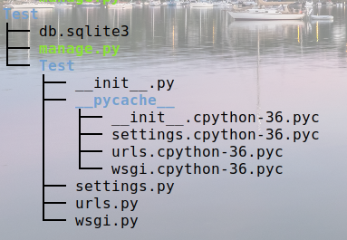

# Django总结

## 1. 虚拟化环境创建(linux系统)

```
1.安装		
	pip install virtualenv
2.创建虚拟环境  
	cd ~/项目文件夹
	virtualenv .xxx
3.激活虚拟环境
	source ~/项目文件夹/.xxx/bin/activate
4.查看虚拟环境
	pip freeze 第三方安装包
	pip list   系统安装包
	虚拟环境迁移
		迁出：pip freeze > requirements.txt
		迁入：pip install -r requirements.txt
5.退出虚拟环境
	deactivate
```

## 2. 虚拟化环境创建(windows系统)

```
1.安装		
	pip install virtualenv
2.创建虚拟环境
	G:按回车	# 盘符:
	cd 项目文件夹
	virtualenv .xxx
3.激活虚拟环境
	cd Scripts
	activate.bat
4.查看虚拟环境
	pip freeze 第三方安装包
	pip list   系统安装包
	虚拟环境迁移
		迁出：pip freeze > requirements.txt
		迁入：pip install -r requirements.txt
5.退出虚拟环境
	deactivate
```

## 3. 创建Django步骤

```
1.创建虚拟环境(上面有步骤)
2.安装Django
	pip install Django==1.11.7
3.创建Django项目
	django-admin startproject xxx
4.启动服务器的命令
    python manage.py runserver
5.项目结构(后面有图)
6.修改虚拟环境的步骤
	file-->setting-->project interpreter-->设置(add)-->exist environment-->选择...虚拟环境的文件夹-->bin-->python3.6
7.全局配置文件(项目下的settings.py中)
	1.允许访问的主机 '*'所有人都可以访问
		ALLOWED_HOST=["*"]
	2.修改欢迎页面为中文
		'en-us'英文    'zh-hans'中文
		在settings中修改LANGUAGE_CODE = 'zh-hans'
	3.修改为当前系统时间
		在settings中修改TIME_ZONE = 'Asia/Shanghai'
	4.修改写入到数据库时间为当前时间
		USE_TZ = False
8.启动服务器设置端口号和主机
	1.python manage.py runserver
    2.python manage.py runserver 9000
    3.python manage.py runserver 0.0.0.0:9000
```

## 4. 项目结构



## 5. 视图函数的位置

### 1. 项目下

```
1.在urls.py中定义路由路径
	url(r'^路径/',views.视图函数名字不加圆括号)
	eg:url(r'^index/',views.index)
2.在views中定义视图函数
	def index(request):
		return HttpResponse('index')
如果把所有的视图函数都放在项目下了 那么代码看起来就特别的臃肿所以我们一般的企业级开发 都是把每一个模块封装出一个app
```

### 2. App下

```
1.创建App(两种方法)
	1.django-admin startapp App
	2.python manage.py startapp App
2.在App中创建urls.py
3.在urls.py中创建urlpatterns=[]我们称在app下urls.py叫做子路由
4.在根路由(项目下的urls.py)加载子路由
	url(r'^app/',include('App.urls'))
5.在子路由(App下的urls.py)中定义请求资源路径也就是路由
	url(r'^index',views.index)
6.在App下的views.py中创建视图函数
	def index(request):
		return HttpResponse('index')
7.访问 127.0.0.1:8000/根路由名字/子路由名字/
	127.0.0.1:8000/app/index
```

## 6. 视图函数的返回

### 1. 项目下

```
1.HttpResponse()
	1.HttpResponse('123')返回字符串
	2.HttpResponse('<h1>123</h1>')返回标签
2.render(request,'xxx.html')  
	1.在项目下创建templates文件夹(templates单词不能打错)
	2.在templates文件夹下创建xxx.html
	3.在settings.py中进行注册
		settings.py --> TEMPLATES --> DIRS中添加
		os.path.join(BASE_DIR,'templates')
注意：开发中常用项目目录下的模板    理由：模板可以继承,复用
```

### 2. App下

```
1.HttpResponse()
	1.HttpResponse('123')返回字符串
	2.HttpResponse('<h1>123</h1>')返回标签
2.render(request,'xxx.html')   
	1.在App下创建templates文件夹(templates单词不能打错)
	2.在templates文件夹下创建xxx.html
	3.在settings.py里的INSTALLED_APPS设置App路径
		'App'或者'App.appsAppConfig'
```

## 7. 模型(M)

### 1. 基本配置

```
1.修改数据库参数——项目下setting.py文件中DATABASES下添加
	注释掉之前的数据库ENGINE和NAME
	'ENGINE': 'django.db.backends.mysql'	# 引擎
	'NAME' : 'dhf'			# 数据库名字
	'USER' : 'root' 		# 用户名字
	'PASSWORD' : '123456'	# 密码
	'HOST' : 'localhost'	# 主机
	'PORT' : '3306'			# 端口号
2.安装pymysql
	pip install pymysql
3.驱动申明——App下__init__.py文件中
	import  pymysql
	pymysql.install_as_mysqldb()
```

### 2. DML( 数据操作语言)

```
1.模型定义——App下的models.py文件中
	1.继承models.Model
	2.会自动添加主键列
	3.必须指定字符串类型属性的长度
	class Student(models.Model):
    	name = modes.CharField(max_length=16)
        age = models.IntegerField(default=1)
2.迁移——命令终端中敲入
	1.生成迁移文件
		python manage.py makemigrations
	2.执行迁移生成数据库中的表
		python manage.py migrate
	注意：默认的13张表已有迁移文件，直接迁移成表就行
		 如果是自定义的模型，那么先生成迁移文件，后迁移成表
3.增删改查
	增
	def addStudent(request):
		student = Student()	# 创建student对象
		student.name = 'DHF'
		student.age = 18
		student.save()
		return HttpResponse('增加成功')
	查
	查询所有
	def findStudent(request):
		student_list = Student.objects.all()
		for student in student_list:
			print(student.id,student.name,student.age)
		return HttpResponse('查询成功')
	查询单个
	def findStudent(request):
		# get是根据主键查询
		student = Student.objects.get(pk=1)
		print(student.id,student.name,student.age)
		return HttpResponse('查询成功')
	修改
	def updateStudent(request):
		student = Student.objects.get(pk=1)
		student.name = '李逵'
		student.save()
		return HttpResponse('修改成功')
	删除
	def deleteStudent(request):
		student = Student.objects.get(pk=1)
		student.delete()
		return HttpResponse('删除成功')
```

### 3. Django Shell

```
1.使用django终端
	python manage.py shell
2.通常用来调试
	from Two.models import Student
	students = Student.objects.all()
	for student in students:
         print(students.name)
```

### 4. 元信息

```
class Student(models.Model):
	name = modes.CharField(max_length=16)
    age = models.IntegerField(default=1)
    class Meta:
    	db_table = 'student'	# 指定创建的表名
```

### 5. 数据及联

+ 模型一对一

  ```
  1.
  ```

+ 模型一对多

  ```
  1.
  ```

+ 模型多对多

  ```
  1.
  ```

### 6. 定义字段

```
字段类型：
	1.AutoField
		一个根据实际ID自动增长的IntegerField，
		通常不指定如果不指定，一个主键字段将自动添加到模型中
	2.CharField(max_length=32)	字符串,括号里面的字段约束必须写
	3.TextField		大文本字段，一般超过4000使用
	4.IntegerField	整型
	5.DecimalField(max_digits=None, decimal_places=None)十进制浮点数
    	DecimalField.max_digits		位数总数
		DecimalField.decimal_places	小数点后的数字位数
	6.FloatField			浮点数
	7.BooleanField		true/false 字段
	8.NullBooleanrField	支持null、true、false三种值
	9.DateField([auto_now=False, auto_now_add=False])
		DateField.auto_now
			每次保存对象时，自动设置该字段为当前时间，
			用于"最后一次修改"的时间戳，它总是使用当前日期，默认为false
		DateField.auto_now_add
			当对象第一次被创建时自动设置当前时间，
			用于创建的时间戳，它总是使用当前日期，默认为false
	10.TimeField	表示的时间，参数同DateField
	11.DateTimeField表示的日期和时间，参数同DateField
	12.FileField	一个上传文件的字段
	13.ImageField  图片
字段约束：
	1.max_length	最大长度
	2.default		默认值
	3.unique		唯一值
	4.db_index		索引值
	5.primary_key	主键字段
	6.db_column		字段的名称，如果未指定，则使用属性的名称
```

### 7. 模型过滤(查询)

```
Django有两种过滤器用于筛选记录：(可以链式调用)
	filter:返回符合筛选条件的数据集
		Person.objects.filter(p_age__in=[50,60,61])
	exclude	:返回不符合筛选条件的数据集
		Person.objects.exclude(p_age__gt=50)
```

### 8. 创建对象的方式

```
创建对象的方式(四种方法)
1.创建对象1——常用
	person = Person（）   
	person.p_name='zs'  
	person.p_age=18
2.创建对象2
	person =  Model.objects.create(p_name='zs',p_age=18)
	person.save()
3.创建对象3
	person = Person(p_age=18)
	person.save()
4.创建对象4
	1.在models.py中Person类中
		@classmethod  
    	def create(cls,p_name,p_age=100):
    		return cls(p_name=p_name,p_age=p_age)
   2. 在views.py中
   	 	person = Person.create('zs')
   	 	person.save()
```

### 9. 查询集

```
1.概念：查询集表示从数据库获取的对象集合，查询集可以有多个过滤器。
2.过滤器:过滤器就是一个函数,基于所给的参数限制查询集结果,返回查询集的方法称为过滤器。
3.获取查询结果集  QuerySet
	1.all
		模型.objects.all()
	2.filter
		模型.objects.filter()
	3.exclude
		模型.objects.exclude()
	4.order_by
```


## 8. 模板显示(T)

```

```

## 9. 

## 10. 

