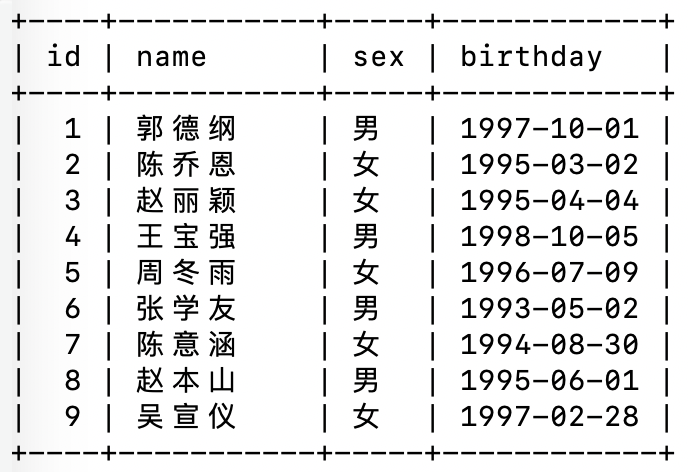

# 数据库入门

> **Organization**: 千锋教育 Python 教学部<br>
> **Date** : 2019-09-01<br>
> **Author**: [张旭](mailto:zhangxu@1000phone.com)


## 一、数据库及其发展史

### 1. 历史

在关系型数据库出现之前，主要是网状数据库（Network Databases）和层次数据库（Hierarchical Databases）。最早出现的是网状DBMS，是美国通用电气公司Bachman等人在1961年开发成功的IDS（Integrated DataStore），网状数据库模型对于层次和非层次结构的事物都能比较自然的模拟，当时网状DBMS要比层次DBMS用得更普遍。在数据库发展史上，网状数据库占有重要地位。


层次型数据库紧随网络型数据库出现。最著名最典型的层次数据库系统是IBM公司在1968年开发的IMS（Information Management System），一种适合其主机的层次数据库。这是IBM公司研制的最早的大型数据库系统程序。


1970 年，IBM研究员E.F.Codd博士在刊物Communication of the ACM上发表了一篇名为“A Relational Modelof Data for Large Shared Data Banks”的论文，提出了关系模型的概念，奠定了关系模型的理论基础。


1970年关系模型建立之后，IBM公司在San Jose实验室增加了更多的研究人员研究这个项目，这个项目就是著名的System R，目标是论证一个全功能关系DBMS的可行性。（该项目结束于1979年，完成了第一个实现SQL的DBMS）。

1973年加州大学伯克利分校的Michael Stonebraker 和EugeneWong利用System R已发布的信息开始开发自己的关系数据库系统Ingres（ORACLE数据库的雏形）。

由于当时IBM实验室的体制（IBM的研究人员大多是学术出身，他们最感兴趣的是理论和学术成果，而非推向市场的产品），以及当时IBM对IMS的承诺，IBM并不是第一个发布商用关系型数据库的公司。第一个商用关系型数据库是由霍尼韦尔公司在1976年发布Multics Relational Dat a Store（非SQL标准语句）。

1978年Ellison在为中央情报局做一个数据项目时，仔细阅读了codd发表的“R系统:数据库关系理论”，这个论文主要介绍了关系数据库理论和查询语言SQL。Ellison看完后，敏锐意识到在这个研究基础上可以开发商用软件系统。而当时大多数人认为关系数据库不会有商业价值。而就在几个月后，Oracle 1.0诞生了，oracle这个名字也来源于他们曾给中央情报局做过的项目名。

直到1985年IBM才发布了关系数据库DB2，那时oracle已经占有了很大的市场，Ellision已经成了千万富翁。1989年，微软发布了SQL Server 1.0版。三大商用关系型数据库的发布年份，也正好对应了市场占有率的排名。

### 2. SQL语言

SQL 全拼为 Structured Query Language, 即 “结构化查询语言”。

SQL语言诞生于1974年，是IBM提出的，但是关系型数据库在1970年已经出现，在没有出现SQL语言之前当时的查询语言依赖于复杂的数学逻辑和符号，查询语言成为关系型数据库发展的一个主要瓶颈，SQL的出现使没有接受过数学和计算机编程正规训练的用户也能简便的使用。

SQL 是一种特殊目的的编程语言，是一种数据库查询和程序设计语言，用于存取数据以及查询、更新和管理关系数据库系统；同时也是数据库脚本文件的扩展名。


### 3. 关系型数据库

| 数据库     | SQL 类型         | 公司               |
| ---------- | ---------------- | ------------------ |
| Oracle     | PL/SQL           | 甲骨文             |
| MySQL      | My/SQL           | 甲骨文             |
| SQL-Server | T-SQL            | 微软               |
| Access     | SQL              | 微软               |
| SQLite     | 内嵌型小型数据库 | 移动前端用的比较多 |


## 二、数据库相关术语和概念

- **数据库**: 数据库是一些关联表的集合。

- **数据表**: 表是数据的矩阵。在一个数据库中的表看起来像一个简单的电子表格。

- **列**: 一列(数据元素) 包含了相同类型的数据, 例如邮政编码的数据。

- **行**: 一行（=元组，或记录）是一组相关的数据，例如一条用户订阅的数据。

- **冗余**: 存储两倍数据，冗余降低了性能，但提高了数据的安全性。

- **主键**: 主键是唯一的。一个数据表中只能包含一个主键。你可以使用主键来查询数据。

- **外键**: 外键用于关联两个表。

- **复合键**: 复合键（组合键）将多个列作为一个索引键，一般用于复合索引。

- **索引**: 使用索引可快速访问数据库表中的特定信息。索引是对数据库表中一列或多列的值进行排序的一种结构。类似于书籍的目录。

- **参照完整性**: 参照的完整性要求关系中不允许引用不存在的实体。与实体完整性是关系模型必须满足的完整性约束条件，目的是保证数据的一致性。




## 三、Linux数据库的开启和连接

### 1. 安装数据库

```shell
sudo apt install -y mysql-server mysql-client
```

### 2. 开启数据库服务

1. Ubuntu : `service mysql start|stop|restart|status`
2. Deepin : `systemctl start|stop|restart|status mysqld`
3. CentOS7 : `systemctl start|stop|restart|status mysqld`
4. CentOS6 : `service mysqld start|stop|restart|status`

### 3. 连接数据库

各个 Linux 系统连接数据库都一样

语法: `mysql -hloaclhost  -uroot -p123456 -P3306`

1. -h : host(ip地址)   localhost = 127.0.0.1
2. -u : username(用户账户)
3. -p : password(密码)
4. -P : port(端口, 默认端口3306)

**备注**
第一次使用 root 连接后最好添加一个新的用户来操作。出于安全考虑，日常开发中最好不要使用 root

```sql
-- 创建新用户，并设置密码
-- *.* 代表该用户可以操作任何库、任何表
-- 主机名可以使用 '%', 代表允许该用户从任何机器登陆
GRANT ALL PRIVILEGES on *.* to '用户名'@'localhost' IDENTIFIED BY "密码" WITH GRANT OPTION;

-- 刷新使权限生效
flush privileges;
```

### 4. 退出数据库

四种方式效果一样:

1. exit
2. quit
3. \q
4. 快捷键: ctrl + d

### 5. 密码忘记怎么办?

1. 打开配置: `vim /etc/mysql/my.cnf`

2. 添加这么一段:

    ```ini
    [mysqld]
    skip-grant-tables
    ```

    如果文件中已存在 `[mysqld]`, 则直接将 `skip-grant-tables` 写到其下方即可。

3. 修改完成后，保存退出，重启服务: `sudo systemctl restart mysqld`


## 四、权限管理

### 1. MySQL 权限的两个阶段

1. 第一阶段为连接验证，主要限制用户连接 mysql-server 时使用的 ip 及 密码
2. 第二阶段为操作检查，主要检查用户执行的指令是否被允许，一般非管理员账户不被允许执行 drop、delete 等危险操作

### 2. 权限控制安全准则

1. 只授予能满足需要的最小权限，防止用户执行危险操作。
2. 限制用户的登录主机，防止不速之客登录数据库。
3. 禁止或删除没有密码的用户。
4. 禁止用户使用弱密码。
5. 定期清理无效的用户，回收权限或者删除用户。

### 3. 常用操作

1. 创建账户、权限授予

    - 8.0 之前版本

        ```sql
        GRANT ALL PRIVILEGES on *.* to '用户名'@'主机' IDENTIFIED BY "密码" WITH GRANT OPTION;
        flush privileges; -- 刷新使权限生效
        ```

        - `ALL PRIVILEGES`: 授予全部权限, 也可以指定 `select`、`insert` 等
        - `*.*`: 允许操作的数据库和表
    - `WITH GRANT OPTION`: 带有该子句说明允许用户将自己拥有的权限授予别人

    - 8.0 之后的版本

        ```sql
        CREATE USER `用户名`@`主机` IDENTIFIED BY '密码';  -- 创建账户
        GRANT ALL ON *.* TO `用户名`@`主机` WITH GRANT OPTION;  -- 授权
        ```

2. 修改密码

    ```sql
    ALTER USER 'root'@'localhost' IDENTIFIED WITH mysql_native_password BY '你的密码';"
    ```

3. 查看权限
    ```sql
    show grants;  -- 查看当前用户的权限
    show grants for 'abc'@'localhost';  -- 查看用户 abc 的权限
    ```

4. 回收权限

    ```sql
    revoke delete on *.* from 'abc'@'localhost';
    ```

5. 删除用户

    ```sql
    use mysql;
    select host, user from user;
    drop user 用户名@'%';
    ```

## 五、数据库的操作

### 1. 创建数据库

```sql
create database [if not exists] `数据库名` charset=字符编码(utf8mb4);
```

1. 如果多次创建会报错
2. 字符编码不指定默认 utf8mb4
3. 给数据库命名一定要习惯性加上反引号, 防止和关键字冲突

### 2. 查看数据库

```sql
show databases;
```

### 3. 选择数据库

```sql
use `数据库的名字`;
```

### 4. 创建数据库

```sql
create database `数据库名`;
```

### 5. 修改数据库

```sql
-- 只能修改字符集
alter database `数据库名` charset=字符集;
```

### 6. 删除数据库

```sql
drop database [if exists] `数据库的名字`;
```


## 六、表的操作

表是建立在数据库中的数据结构，是一类数据的存储集。

### 1. 表的创建

```sql
create table [if not exists] `表的名字`(
    id int not null auto_increment primary key comment '主键',
    account char(255) comment '用户名' default 'admin',
    pwd varchar(65535) comment '密码' not null
) engine=myisam charset=utf8mb4;
```

备注:
- 字符集如果不指定, 默认继承库的字符集.
- engine 默认innodb

### 2. 查看所有的表

选择数据库后，才能查看表

```sql
show tables;
```


### 4. 删除表

删除表必须在数据库中进行删除

```sql
drop table [if exists] `表名`
```

### 5. 显示建表结构
```
desc `表名`;
describe `表名`;
```

### 6. 修改表

```sql
-- 修改表的名称
alter table `old_name` rename `new_name`;

-- 修改表的引擎
alter table `表名` engine = innodb|myisam;

-- 移动表 到指定的数据库
alter table `表名` rename to 数据库名.表名;
```

### 7. 修改字段

```sql
-- 增加一个新的字段
alter table `表名`  add `字段名` 数据类型 属性;
-- 增加一个新的字段, 并放在首位
alter table `表名`  add `字段名` 数据类型 属性 first;
-- 增加一个新的字段, 并放在某一个字段之后
alter table `表名`  add `字段名` 数据类型 属性 after 指定字段;

-- 修改字段的属性
alter table `表名` modify `字段名` 数据类型 属性;

-- 修改字段的名称
alter table `表名` change `原字段名` `新的字段名` 数据类型 属性;

-- 修改字段的位置
alter table `表名` change `原字段名` `新的字段名` 数据类型 after `指定字段`;

-- 删除字段
alter table `表名` drop `字段名`;
```

### 8. 复制表

1. 先在创建一个表，并在表中插入一些数据

    ```sql
    /* 创建 abc 表*/
    create table abc(
        id int primary key auto_increment comment '主键',
        username char(32) not null comment '账户',
        password char(32) not null comment '密码'
    ) engine=myisam;

    /* 插入两条数据 */
    insert into abc values(null, 'tom', md5(123456)), (null, 'bob', md5(123456));
    ```

2. 复制表，并且复制数据
    - 执行:

        ```sql
        create table `复制表的名称` select * from `原表名`;
        ```

    - 特点: 完整的复制一个表，既有原表的结构，又有原表的数据

3. 仅复制表结构, 不复制数据
    - 执行:

        ```sql
        create table `复制表的名称` like `原表名`;
        ```

    - 特点: 复制后的表结构与原表相同，但是里面没有数据，是一张空表
    - 如果需要，数据可以单独复制

        ```sql
        insert into `复制表的名称` select * from `原表名`;
        ```


## 七、CURD 语句的基本使用

对表中数据的操作一般分为四类, 常记做 "CURD":

- C: 创建（Create）
- U: 更新（Update）
- R: 读取（Retrieve）
- D: 删除（Delete）


### 1. INSERT 插入

完整的 insert 语句为:

```sql
INSERT INTO `表名` (`字段1`, `字段2`, ...) VALUES (`值1`, `值2`, ...);
```

其中的 `INTO` 在 MySQL 数据库中可以省略, 但在某些数据库中必须要有。

```sql
-- 一次插入一行
insert into `表名` set `字段`=值, `字段`=值;

-- 按照指定字段, 一次插入多行
insert into `表名` (字段1, 字段2 ...) values (值1, 值2, ...), (值1, 值2, ...);

-- 指定全部字段, 一次插入多行
insert into `表名` values (null, 值1, 值2, ...), (null, 值1, 值2, ...);
```

### 2. SELECT (查询)

```sql
-- 通过 * 获取全部字段的数据
select * from `表名`;

-- 获取指定字段的数据
select `字段1`, `字段2` from `表名`;
```

### 3. UPDATE (更新)

```sql
-- 修改全表数据
update `表名` set `字段1`=值, `字段2`=值;

-- 使用 where 修改满足条件的行
-- where 类似于 if 条件, 只执行返回结果为 True 的语句
update `表名` set `字段1`=值, `字段2`=值 where `字段`=值;
update `表名` set `字段1`=值, `字段2`=值 where `字段`=值 and `字段`=值;
```

### 4. DELETE (删除)

```sql
-- 删除表中的所有数据 (逐行删除)
delete from `表名`;
-- 清空全表 (一次性整表删除)
truncate `表名`

-- 使用 where 修改满足条件的行
delete from `表名` where `字段` = 值;
delete from `表名` where `字段` in (1, 2, 3, 4);
```


## 八、小总结

- 增
    - **数据库**:
        ```sql
        create database `库名`;
        ```

    - **表**:
        ```sql
        create table `表名`;
        ```

    - **字段**:
        ```sql
        alter table `表名` add `字段名` 类型 [属性];
        ```

    - **数据**:
        ```sql
        insert into `表名`;
        ```


- 删
    - **数据库**:
        ```sql
        drop database `库名`;
        ```

    - **表**:
        ```sql
        drop table `表名`;
        ```

    - **字段**:
        ```sql
        alter table `表名` drop `字段名`;
        ```

    - **数据**:
        ```sql
        delete from `表名` where ...;
        ```


- 改
    - **数据库**:
        ```sql
        alter database `库名` ...;
        ```

    - **表**:
        ```sql
        alter table `表名` ...;
        ```

    - **字段**:
        ```sql
        alter table `表名` modify | change ...;
        ```

    - **数据**:
        ```sql
        update `表名` set ...;
        ```


- 查
    - **数据库**:
        ```sql
        show databases [like ...];
        ```

    - **表**:
        ```sql
        show tables [like ...];
        ```

    - **字段**:
        ```sql
        desc `表名`;
        ```

    - **数据**:
        ```sql
        select * from `表名` where ...;
        ```
