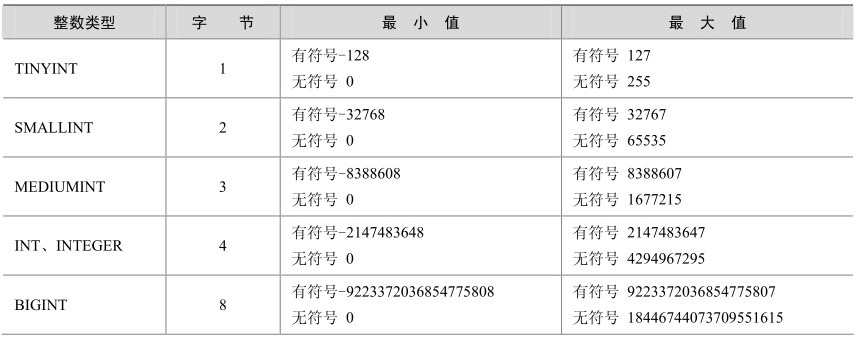
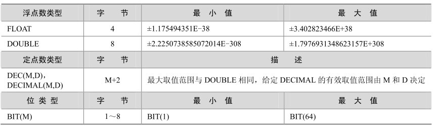
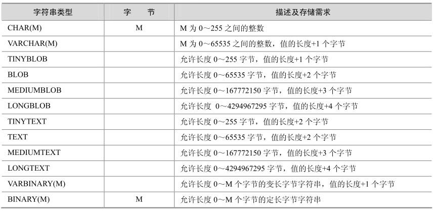
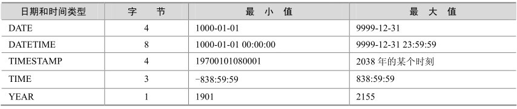
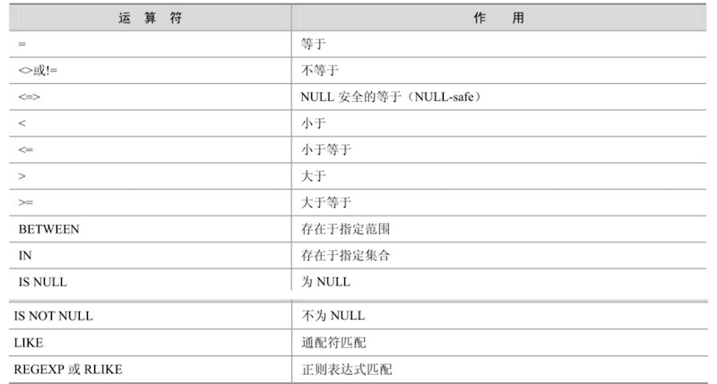
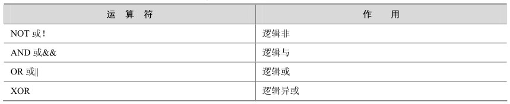

# MySQL中的编码和数据类型

> **Organization**: 千锋教育 Python 教学部<br>
> **Date** : 2019-09-02<br>
> **Author**: [张旭](mailto:zhangxu@1000phone.com)


## 一、字符集

1. 字符集在什么时候可以发挥作用?

   1. 保存数据的时候需要使用字符集
   2. 数据传输的时候也需要使用字符集
   3. 在存续的时候使用字符集
      1. 在MySQL的服务器上, 在数据库中, 在表的使用上, 在字段的设置上.
      2. 在服务器安装的时候, 可以指定默认的字符集

2. 常见字符集

    - **ASCII**: 基于罗马字母表的一套字符集, 它采用1个字节的低7位表示字符, 高位始终为0。
    - **LATIN1**: 相对于ASCII字符集做了扩展, 仍然使用一个字节表示字符, 但启用了高位, 扩展了字符集的表示范围。
    - **GB2312**: 简体中文字符, 一个汉字最多占用2个字节
    - **GB**: 只是所有的中文字符, 一个汉字最多占用2个字节
    - **UTF8**: 国际通用编码, 一个汉字最多占用3个字节
    - **UTF8MB4**: 国际通用编码, 在utf8的基础上加强了对新文字识别, 一个汉字最多占用4个字节

    ```sql
    /* gbk字符集最大字符串长度: 65535/2 -1 */
    create table test(
        text varchar(32766)
    ) charset=gbk;

    /* utf8字符集最大字符串长度: 65535/3 -1 */
    create table test1(
        text varchar(21844)
    ) charset=utf8;

    /* utf8mb4字符集最大字符串长度: 65535/4 -1 */
    create table test4(
        text varchar(16382)
    ) charset=utf8mb4;
    ```

3. 查看当前mysql系统支持的字符集

    ```sql
    mysql> show variables like 'character_%';

    /* 输出:
    +--------------------------+------------+
    | Variable_name            | Value      |
    +--------------------------+------------+
    | character_set_client     | utf8mb4    |  客户端来源数据使用的字符集
    | character_set_connection | utf8mb4    |  连接层字符集
    | character_set_database   | utf8mb4    |  当前选中的数据库的默认字符集
    | character_set_filesystem | binary     |  文件系统字符集
    | character_set_results    | utf8mb4    |  查询结果使用的字符集
    | character_set_server     | utf8mb4    |  默认的内部操作字符集
    | character_set_system     | utf8       |  系统元数据(字段名、表名等)的字符集
    | character_sets_dir       | /usr/lo... |
    +--------------------------+------------+
    */
    ```

4. 修改当前的 mysql 系统的字符集编码

    - 全部修改
        ```sql
        set names gbk;
        ```

    - 指定修改

        ```sql
        set character_set_client = gbk;
        set character_set_results = gbk;
        ```

    - 它是临时性命令, mysql链接断开以后, 再次连接时会恢复原状

## 二、校对集

在某一种字符集下, 为了使字符之间可以互相比较, 让字符和字符形成一种关系的集合, 称之为校对集。

比如说 ASCII 中的 a 和 B, 如果区分大小写 a > B, 如果不区分 a < B;

不同字符集有不同的校对规则, 命名约定：以其相关的字符集名开始, 通常包括一个语言名, 并且以 `_ci`、`_cs` 或 `_bin` 结束。

- `_ci`: 大小写不敏感
- `_cs`: 大小写敏感
- `_bin`: binary collation 二元法, 直接比较字符的编码, 可以认为是区分大小写的, 因为字符集中'A'和'a'的编码显然不同。

```sql
/* 数据库默认的排序方式,是升序 */
create table t1(
    str char(1)
) charset=utf8mb4 collate=utf8mb4_general_ci;  -- _general_ci 后缀的都是不区分大小写的

create table t2(
    str char(1)
) charset=utf8mb4 collate=utf8mb4_bin;  -- 看到后缀边是_bin的都是区分大小的


/*
Linux中Mysql是区分大小的
需要自己去配置
vim /etc/my.cnf
找到[mysqld]
1是不区分大小写,0是区分大小写
*/
lower_case_table_names=1
```

```sql
show character set;  -- 查看字符集 和 校对集
show collation;      -- 显示所有的校对集
```

## 三、MySQL的数据类型

### 1. 整型



- 一个无符号数一定是非负数

    ```sql
    create table t3(
        age tinyint unsigned
    );
    ```

- 显示宽度 (zerofill)

    整型显示宽度, 位数不足时用 0 填充

    ```sql
    create table t4(
        id int(10) zerofill primary key auto_increment,
        name char(32)
    );
    insert into t4 values(12345, '5个');
    insert into t4 values(1234567890, '10个');
    insert into t4 values(123456789012, '12个');
    select * from t4;
    ```

### 2. 浮点型



定点数的位数更加长
使用方式:

- float(M,D)
- double(M,D)
- decimal(M,D)
- M 是支持多少个长度, D 是小数点后面的位数

```sql
create table t5 (
    a float(10, 2),
    b double(10, 2),
    c decimal(10, 2)
);
```

### 3. 字符串类型



`CHAR` 与 `VARCHAR` 类型的区别

| Type       | Input       | Saved in DB | Size    | Desc                                    |
| ---------- | ----------- | ----------- | ------- | --------------------------------------- |
| CHAR(5)    | `"a"`       | `"a    "`   | 5 bytes | 固定占 5 字节, 不足的用空格补齐         |
| VARCHAR(5) | `"a"`       | `"a"`       | 2 bytes | 字符占 1 字节, 额外用 1 字节记录位长    |
| CHAR(5)    | `"abc  "`   | `"abc  "`   | 5 bytes | 保留结尾空格, 依然占 5 字节             |
| VARCHAR(5) | `"abc  "`   | `"abc"`     | 4 bytes | 删除结尾空格, 再加位长记录, 共占 4 字节 |
| CHAR(5)    | `"abcdefg"` | `"abcde"`   | 5 bytes | 截掉超出的字符, 会抛错                  |
| VARCHAR(5) | `"abcdefg"` | `"abcde"`   | 6 bytes | 截掉超出的字符, 会抛错                  |

思考：

字符串、浮点型等都可以随意指定大小, 那么是不是平时操作的时候随意指定一个就可以呢？

答：不是, 数据类型并不是越大越好, 越大的类型会造成数据臃肿, 存储空间占用过大, 数据检索也会变慢


### 4. 枚举(enum)

多选一的时候使用的一种数据类型

在前端使用单选框的时候, 枚举类型可以发挥作用

枚举类型的优点:
1. 限制了可选值
2. 节省空间
3. 运行效率高

```sql
create table t6(
    name varchar(32),
    sex enum('男','女','保密') default '保密'
);

-- 枚举类型的计数默认从1开始
insert into t6 set name='王宝强',sex=1;
```

### 5. 集合(set)

SET最多可以有64个不同的成员。类似于复选框, 有多少可以选多少。

```sql
create table t7 (
    name varchar(32),
    hobby set('吃','睡','玩','喝','抽')
);

insert into t7 values('张三','睡,抽,玩,吃,喝');
insert into t7 values('李四','睡,抽');
```

- 为什么不是用 set 类型?

    在现代网站开发中, 多选框的值有上千个, 值存储的空没有索引用的多

- 那复选框的问题怎么解决?

    将复选框的值单独设计成一张表

### 6. 时间类型



#### 1. datetime

```sql
create table datetime_test (
    create_at datetime
);

insert into datetime_test values('2019-4-2 16:54:00');
insert into datetime_test values('2019/4/2 16:54:00');
insert into datetime_test values(now());
-- 年份最大支持4个长度
insert into datetime_test values('10000/4/2 16:54:00');  -- 错误
insert into datetime_test values('9999/4/2 16:54:00');
```

#### 2.time

```sql
create table time_test (
    create_at time
);

insert into time_test values('12:12:12');
insert into time_test values('100:12:12');
insert into time_test values('-100:12:12');
insert into time_test values('10 10:12:12');
-- 时间的范围是: [-838:59:59 - 838:59:59]
insert into time_test values('839:12:12'); -- 错误的
```

#### 3.timestamp 时间戳类型

- 时间戳类型在显示方面和datetime是一样的, 在存储上不一样
- 范围从 1970-1-1 0:0:0 到 2038-1-19 11:14:07
- 时间戳使用 4 个字节表示
- 该值大小与存储的位长有关: 2 ** (4 * 8 - 1)

```sql
create table timestamp_test (
    create_time timestamp
);

insert into timestamp_test values(now());
insert into timestamp_test values('2038-1-19 11:14:07');  -- 时间戳最大值
insert into timestamp_test values('2038-1-19 11:14:08');  -- 错误
```

#### 4.year

```sql
create table `year`(
    create_at year
);

-- 从1900年开始 - 1900+255

insert into `year` values(now());
insert into `year` values('2155'); -- 年份最大值
insert into `year` values('2156'); -- 错误
```

### 7. 布尔型

mysql中的bool类型也是1和0

```sql
create table `bool`(
    cond boolean
);

insert into `bool` set cond=True;    -- 成功
insert into `bool` set cond=False;   -- 成功
insert into `bool` set cond=1;       -- 成功
insert into `bool` set cond=10;      -- 成功
insert into `bool` set cond=-1;      -- 成功
insert into `bool` set cond=0;       -- 成功
insert into `bool` set cond=0.1;     -- 成功
insert into `bool` set cond='True';  -- 失败
```

### 8. 列的属性

- 插入的值是否可以为空
    - `null`: 是可以为空,默认不写
    - `not null`: 不可以为空,如果插入的时候,摸个字段的值为空,则报错

    ```sql
    create table null_test (
        id int primary key auto_increment,
        username varchar(32) not null,
        pwd varchar(16) null
    );

    insert into  null_test values(null,null,null);
    ```

- default

    默认值一般是和null做搭配的

    ```sql
    create table default_test (
        id int primary key auto_increment,
        username varchar(32) default 'admin' not null,
        pwd varchar(16) default 123456
    );

    insert into  default_test (username) values ('admin');
    ```

- auto_increment
    - 自动增长的列
    - 默认从 1 开始
    - 常配合主键使用的

    ```sql
    create table auto_inc (
        id int primary key auto_increment,
        name varchar(32)
    );

    insert into auto_inc (name) values ('aaa'), ('bbb'), ('ccc');
    select * from auto_inc;

    /* 输出：
    +----+------+
    | id | name |
    +----+------+
    |  1 | aaa  |
    |  2 | bbb  |
    |  3 | ccc  |
    +----+------+
    */
    ```

- primary key

    - 主键一般是唯一的标识
    - 特性:不能为空,也不能重复,一张表当中只可以拥有一个主键

    ```sql
    -- 这里只有一个主键,这种主键叫做联合主键, 在项目中使用较少
    create table double_pri_test (
        id int,
        sid int,
        primary key(id,sid)
    );

    insert into double_pri_test values (1, 1);
    insert into double_pri_test values (1, 2);  -- 成功
    insert into double_pri_test values (2, 1);  -- 成功
    insert into double_pri_test values (1, 1);  -- 失败
    ```

- unique
    - 唯一键,保证列当中的每一个数据都不重复
    - 邮箱不可以重复,手机号不可以重复

    ```sql
    create table test_uniq (
        id int auto_increment primary key,
        mobile char(11) unique
    );

    insert into test_uniq set mobile=13999999999;
    ```

- comment

    - 字段说明: 给开发者看的, 一般用来对相应字段进行说明

    ```sql
    create table test_cmt (
        ctime datetime comment '这个字段代表创建日期'
    );
    ```

### 9. SQL注释

- 单行注释: `-- 你好`
- 多行注释: `/* 巴拉巴拉 */`
- MySQL 独有的单行注释: `# 哈哈哈哈`


## 四、MySQL的运算符

### 算术运算符

```sql
select 123 + 543, 321 * 5, -456 / 2, 10 % 3, 2 / 0, 3 % 0;

/*  输出:

+-----------+---------+-----------+--------+-------+-------+
| 123 + 543 | 321 * 5 | -456 / 2  | 10 % 3 | 2 / 0 | 3 % 0 |
+-----------+---------+-----------+--------+-------+-------+
|       666 |    1605 | -228.0000 |      1 |  NULL |  NULL |
+-----------+---------+-----------+--------+-------+-------+
1 row in set, 2 warnings (0.00 sec)

*/
```

### 比较运算符



- 常规比较

    ```sql
    select 1=2, 2<3, 3<=4, 4>5, 5>=3, 8!=9, 8<>9, 'abc' = 'Abc', 'z' > 'a';

    /* 输出:

    +-----+-----+------+-----+------+------+------+---------------+-----------+
    | 1=2 | 2<3 | 3<=4 | 4>5 | 5>=3 | 8!=9 | 8<>9 | 'abc' = 'Abc' | 'z' > 'a' |
    +-----+-----+------+-----+------+------+------+---------------+-----------+
    |   0 |   1 |    1 |   0 |    1 |    1 |    1 |             1 |         1 |
    +-----+-----+------+-----+------+------+------+---------------+-----------+
    1 row in set (0.00 sec)

    */
    ```

- 范围比较

    ```sql
    select 123 between 100 and 200, 'b' in ('a', 'b', 'c');

    /* 输出

    +-------------------------+------------------------+
    | 123 between 100 and 200 | 'b' in ('a', 'b', 'c') |
    +-------------------------+------------------------+
    |                       1 |                      1 |
    +-------------------------+------------------------+
    1 row in set (0.04 sec)

    */
    ```

- Null 比较

    ```sql
    select 12 is null, 23 = null, null = null, null <=> null, null is null, 32 is not null;

    /* 输出

    +------------+-----------+-------------+---------------+--------------+----------------+
    | 12 is null | 23 = null | null = null | null <=> null | null is null | 32 is not null |
    +------------+-----------+-------------+---------------+--------------+----------------+
    |          0 |      NULL |        NULL |             1 |            1 |              1 |
    +------------+-----------+-------------+---------------+--------------+----------------+
    1 row in set (0.00 sec)

    */
    ```

- 模糊比较: like

    ```sql
    select 'HelloWorld' like 'hello%';

    /* 输出

    +----------------------------+
    | 'HelloWorld' like 'hello%' |
    +----------------------------+
    |                          1 |
    +----------------------------+
    1 row in set (0.00 sec)

    */
    ```

### 逻辑运算符


