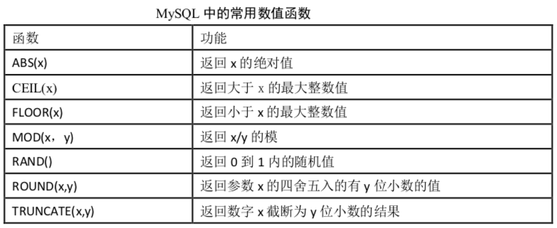
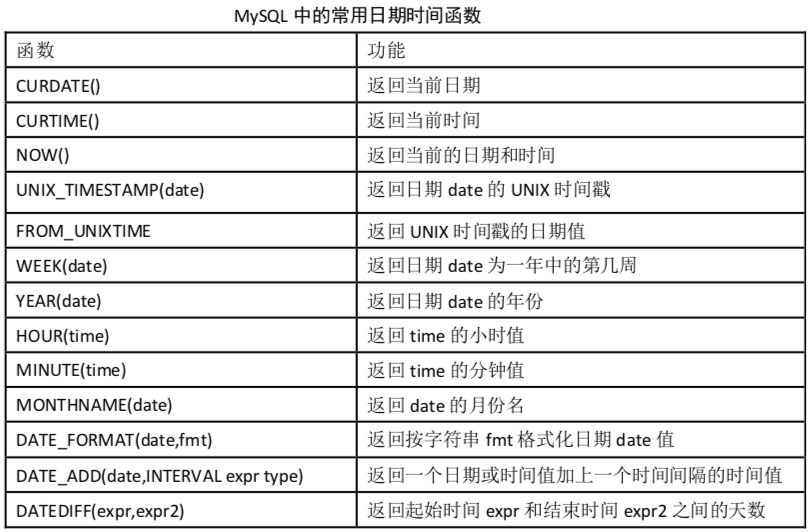
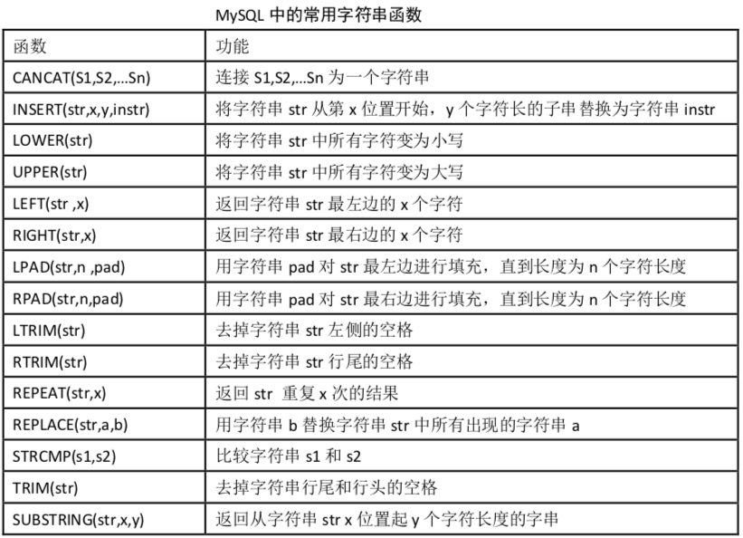
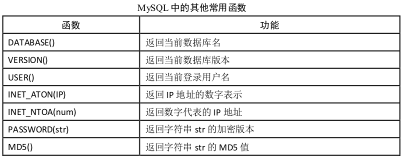

# 数据库的查询

> **Organization**: 千锋教育 Python 教学部<br>
> **Date** : 2019-09-03<br>
> **Author**: [张旭](mailto:zhangxu@1000phone.com)


## 一、构造数据

为了操作方便, 先构造以下数据

1. 学生表

    ```sql
    create table student (
        `id` int unsigned primary key auto_increment,
        `name` char(32) not null unique,
        `sex` enum('男', '女') not null,
        `city` char(32) not null,
        `description` text,
        `birthday` date not null default '1995-1-1',
        `only_child` boolean
    ) charset=utf8;

    insert into student
    (`name`, `sex`, `city`, `description`, `birthday`, `only_child`)
    values
    ('郭德纲', '男', '北京', '班长', '1997/10/1', True),
    ('陈乔恩', '女', '上海', NULL, '1995/3/2', True),
    ('赵丽颖', '女', '北京', '班花, 不骄傲', '1995/4/4', False),
    ('王宝强', '男', '重庆', '阳光大男孩, 超爱吃火锅', '1998/10/5', False),
    ('赵雅芝', '女', '重庆', '全宇宙三好学生', '1996/7/9', True),
    ('张学友', '男', '上海', '全国数学奥林匹克竞赛冠军! 还有谁！', '1993/5/2', False),
    ('陈意涵', '女', '上海', NULL, '1994/8/30', True),
    ('赵本山', '男', '南京', '副班长', '1995/6/1',  True),
    ('张柏芝', '女', '上海', '这家伙很勤奋, 但还是什么都没留下。。。', '1997/2/28', False)
    ('吴亦凡', '男', '南京', '大碗宽面要不要？', '1995/6/1',  True),
    ('鹿晗', '男', '北京', NULL, '1993/5/28', True);
    ('关晓彤', '女', '北京', NULL, '1995/7/12',  True),
    ('周杰伦', '男', '台北', '小伙人才啊', '1998/3/28', False);
    ('马云', '男', '南京', '一个字：真丑，两个字：贼有钱', '1990/4/1',  False),
    ('马化腾', '男', '上海', '深圳小马哥，马云死对头', '1990/11/28', False);
    ```

2. 成绩表

    ```sql
    create table score (
        `id` int unsigned primary key auto_increment,
        `math` float not null default 0,
        `english` float not null default 0
    ) charset=utf8;

    insert into score (`math`, `english`)
    values
    (49, 71), (62, 66.7), (44, 86), (77.5, 74), (41, 75),
    (82, 59.5), (64.5, 85), (62, 98), (44, 36), (67, 56),
    (81, 90), (78, 70), (83, 66), (40, 90), (90, 90);
    ```


## 二、常用的查询语句

### 1. `SELECT`: 字段表达式

- `SELECT` 既可以做查询, 也可以做输出
- 示例

    ```sql
    select random();  -- 随机数
    select unix_timestamp(); -- 显示Unix时间戳
    select id, name from student;
    ```

### 2. `FROM` 子句

- 语法: `select 字段 from 表名;`
- `FROM` 后面是**数据源,** 数据源可以写多个, 数据源一般是表明, 也可以是其他查询的结果
- 示例
    ```sql
    SELECT student.name, score.math FROM student, score;
    ```

### 3. `WHERE` 子句: 按指定条件过滤
- 语法: `select 字段 from 表名 where 条件;`
- `WHERE` 是做条件查询, 只返回结果为 True 的数据
- 示例
    ```sql
    select name from student where city = '上海';
    ```

- 空值判断: `is null | is not null`

    ```sql
    select `name` from `student` where `description` is null;
    select `name` from `student` where `description` is not null;
    ```

- 范围判断:

    - `between ... and ...`
    - `not between ... and ...`

    ```sql
    select id, math from score where math between 60 and 70;
    select id, math from score where math not between 60 and 70;
    select * from score where math>=80 and english<=60;  -- 直接做比较判断
    ```

### 4. `GROUP BY`: 分组查询

- 按照某一字段进行分组, 会把该字段中值相同的归为一组, 将查询的结果分类显示, 方便统计。
- 如果有 WHERE 要放在 WHERE 的后面
- 语法: `select 字段 from 表名 group by 分组字段;`
- 示例

    ```sql
    select sex, count(id) from student group by sex;

    -- 在group将需要的结果通过 “聚合函数” 拼接
    select sex, group_concat(name) from student group by sex;

    -- 添加where语句
    -- 按性别分组, 将上海地区的男生女生姓名连接起来
    select sex, group_concat(name) from student where city='上海' group by sex;
    ```

### 5. `HAVING`

- `HAVING` 与 `WHERE` 在 SQL 中增加 `HAVING` 子句原因是，`WHERE` 关键字无法与聚合函数一起使用

- 语法: `SELECT 字段 FROM 表名 HAVING 条件;`

- `WHERE`:  后面不能加上聚合函数,只能写在.数据源的后面

- `HAVING`: 条件字段必须要在结果集中出现, HAVING 可以写在 `GROUP BY` 的后面

- 示例:
    ```sql
    select `name`, `birthday` from `student` where `birthday` > '1995-1-1';
    select `name`, `birthday` from `student` having `birthday` > '1995-1-1';

    select `name` from `student` where `id` >= 5;
    select `name` from `student` having `id` >= 5;  -- 错误

    select * from student where id>=3 and city='北京';
    select * from student having id>=3 and city='北京';
    select * from student where id>=3 having city='北京';  -- 混用

    -- 取出每个城市中满足最小出生年份大于1995的
    select city, group_concat(birthday) from student group by city having min(birthday) > '1995-1-1';
    ```

### 6. `ORDER BY`: 按字段排序

- `ORDER BY` 主要作用是排序
- `ORDER BY` 写在 `GROUPBY` 后面 ,如果有 `HAVING` 也要写在 `HAVING` 的后面
- 语法: `select 字段 from 表名 order by 排序字段 asc|desc;`
- 分为升序 asc 降序 desc, 默认 asc (可以不写)
- 示例

    ```sql
    select * from student order by age;
    select * from student order by age desc;
    ```


### 7. `LIMIT`: 限制取出数量

- 语法

    ```sql
    select 字段 from 表名 limit m;  -- 从第 1 行到第 m 行
    select 字段 from 表名 limit m, n;  -- 从第 m 行开始，往下取 n 行
    select 字段 from 表名 limit m offset n;  -- 跳过前 n 行, 取后面的 m 行
    ```

### 8. `DISTINCT`: 去重

- 示例

    ```sql
    select distinct city from student;
    ```


### 9. dual表

dual 是一个虚拟表, 仅仅为了保证 `select ... from ...` 语句的完整性

```sql
select now() from dual;
```

## 三、函数

### 聚合函数

| Name             | Description                  |
| ---------------- | ---------------------------- |
| AVG()            | 返回参数的平均值             |
| BIT_AND()        | 按位返回AND                  |
| BIT_OR()         | 按位返回OR                   |
| BIT_XOR()        | 按位返回异或                 |
| COUNT()          | 返回返回的行数               |
| COUNT(DISTINCT)  | 返回许多不同值的计数         |
| GROUP_CONCAT()   | 返回连接的字符串             |
| JSON_ARRAYAGG()  | 将结果集作为单个JSON数组返回 |
| JSON_OBJECTAGG() | 将结果集作为单个JSON对象返回 |
| MAX()            | 返回最大值                   |
| MIN()            | 返回最小值                   |
| STD()            | 返回样本的标准差             |
| STDDEV()         | 返回样本的标准差             |
| STDDEV_POP()     | 返回样本的标准差             |
| STDDEV_SAMP()    | 返回样本标准差               |
| SUM()            | 归还总和                     |
| VAR_POP()        | 返回样本的标准差异           |
| VAR_SAMP()       | 返回样本方差                 |
| VARIANCE()       | 返回样本的标准差异           |

### 数值计算类函数



### 日期计算类函数



### 字符串相关函数



### 其他函数




## 四、多表查询

### `UNION`联合查询

UNION 操作符用于合并两个或多个 SELECT 语句的结果集。

union要求:

1. 两边 select 语句的字段数必须一样
2. 两边可以具有不同数据类型的字段
3. 字段名默认按照左边的表来设置
4. 用法:

    ```sql
    SELECT column_name(s) FROM table1
    UNION
    SELECT column_name(s) FROM table2;
    ```

### `INNER JOIN`: 内连接 (交集)


- INNER JOIN 关键字在表中存在至少一个匹配时返回行。
- 语法
    ```sql
    SELECT 字段
    FROM 表1 INNER JOIN 表2
    ON 表1.字段=表2.字段;

    -- 或：
    SELECT column_name(s)
    FROM table1 JOIN table2
    ON table1.column_name=table2.column_name;
    ```

### `LEFT JOIN`: 左连接


- LEFT JOIN 关键字从左表（table1）返回所有的行，即使右表（table2）中没有匹配。如果右表中没有匹配，则结果为 NULL。

- 语法

    ```sql
    SELECT column_name(s)
    FROM table1
    LEFT JOIN table2
    ON table1.column_name=table2.column_name;

    -- 或：
    SELECT column_name(s)
    FROM table1
    LEFT OUTER JOIN table2
    ON table1.column_name=table2.column_name;
    ```

### `RIGHT JOIN`: 右连接


- RIGHT JOIN 关键字从右表（table2）返回所有的行，即使左表（table1）中没有匹配。如果左表中没有匹配，则结果为 NULL。

- 语法
    ```sql
    SELECT column_name(s)
    FROM table1
    RIGHT JOIN table2
    ON table1.column_name=table2.column_name;

    -- 或：
    SELECT column_name(s)
    FROM table1
    RIGHT OUTER JOIN table2
    ON table1.column_name=table2.column_name;
    ```

### 子查询

查询的语句中还有一个查询

```sql
select name from student where id in (select id from score where math > 10);
```

## 五、视图表

### 视图表的特点

- 视图是数据的特定子集，是从其他表里提取出数据而形成的虚拟表，或者说临时表。
- 创建视图表依赖一个查询。
- 视图是永远不会自己消失的除非手动删除它。
- 视图有时会对提高效率有帮助。临时表不会对性能有帮助，是资源消耗者。
- 视图一般随该数据库存放在一起，临时表永远都是在 tempdb 里的。
- 视图适合于多表连接浏览时使用；不适合增、删、改，这样可以提高执行效率。
- 一般视图表的名称以 `v_` 为前缀，用来与正常表进行区分。
- 对原表的修改会影响到视图中的数据。

### 创建视图

- 语法: `create view 视图名 as 查询语句`
- 示例:
    ```sql
    -- 以上节课的关联查询为例
    create view v_user_score as
    select a.id, a.name, b.math, b.english
    from student a inner join score b on a.id=b order by id;

    -- 查询
    select * from v_user_score;

    -- 删除
    drop view v_user_score;
    ```
