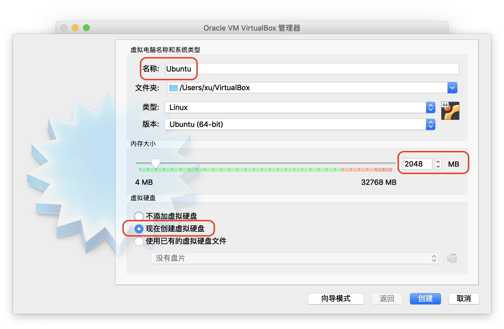
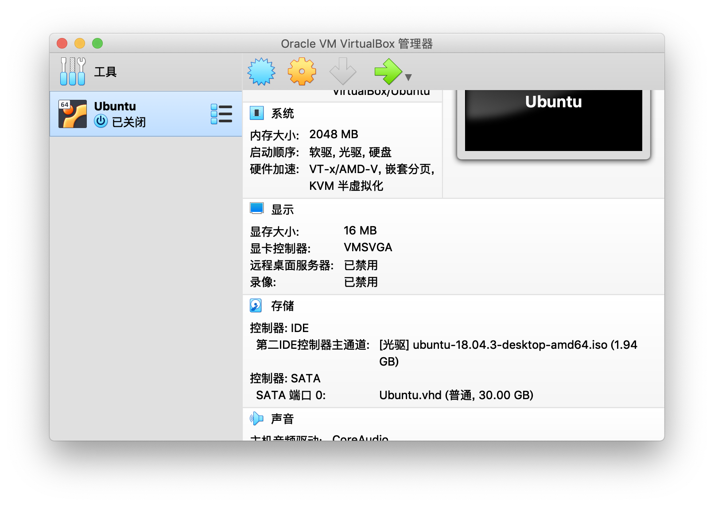

# 初始 Linux

> **Organization**: 千锋教育 Python 教学部<br>
> **Date** : 2019-08-25<br>
> **Author**: [张旭](mailto:zhangxu@1000phone.com)

## Linux发展史及流行版本简介

### 1. **Unix**: 一场关于 “太空旅行游戏” 的游戏


- Ken Thompson: Unix、C 语言、Go 语言、正则表达式、UTF-8, 全都跟这个老爷子有关
- Unix 哲学
    * 小即是美
    * 程序应该只关注一个目标, 并尽可能把它做好
    * 让程序能够互相协同工作, 通过小程序协作完成大的功能
    * 避免使用可定制性低下的用户界面

Unix 操作系统，是一个强大的多用户、多任务操作系统，支持多种处理器架构，按照操作系统的分类，属于分时操作系统，最早由Ken Thompson、Dennis Ritchie 和 Douglas McIlroy于1969年在 AT&T 的贝尔实验室开发。

肯·汤普逊最初在 GE-645 机器上，写出了一个仿真器，可以让一个文件系统与内存分页机制运作起来。他同时也写了一个程序语言Bon，编写了一个太空旅行游戏。经过实际运行后，他发现游戏速度很慢而且耗费昂贵，每次运行会花费75美元。在 GE-645 被搬走后，肯·汤普逊在实验室中寻找没人使用的机器，找到了几台 PDP-7。丹尼斯·里奇的帮助下，汤普逊用 PDP-7 的汇编语言重写了这个游戏，并使其在 DEC PDP-7上运行起来。

1969年，肯·汤普逊开发了一个壳层（shell）与一些驱动程序，做出一个操作系统的雏形。在团队合作下，最终做出了一个分时多任务操作系统，成为第一版UNIX。

第一版 UNIX 是用PDP-7汇编语言编写的，一些应用是由叫做B语言的解释型语言和汇编语言混合编写的。

在进行系统编程时不够强大，所以汤普逊和里奇对其进行了改造，并于1971年共同发明了C语言。

1973年汤普逊和里奇用C语言重写了Unix，形成第三版UNIX。在当时，为了实现最高效率，系统程序都是由汇编语言编写，所以汤普逊和里奇此举是极具大胆创新和革命意义的。用C语言编写的Unix代码简洁紧凑、易移植、易读、易修改，为此后Unix的发展奠定了坚实基础。

此后的10年，Unix在学术机构和大型企业中得到了广泛的应用，当时的UNIX拥有者AT&T公司以低廉甚至免费的许可将Unix源码授权给学术机构做研究或教学之用，许多机构在此源码基础上加以扩展和改进，形成了所谓的“Unix变种”，这些变种反过来也促进了 Unix 的发展，其中最著名的变种之一是由加州大学柏克莱分校开发的伯克利软件套件(BSD)产品。

后来AT&T意识到了Unix的商业价值，不再将Unix源码授权给学术机构，并对之前的Unix及其变种声明了著作权权利。BSD在Unix的历史发展中具有相当大的影响力，被很多商业厂家采用，成为很多商用Unix的基础。其不断增大的影响力终于引起了AT&T的关注，于是开始了一场持久的著作权官司，这场官司一直打到AT&T将自己的Unix系统实验室卖掉，新接手的Novell采取了一种比较开明的做法，允许柏克莱分校自由发布自己的Unix变种，但是前提是必须将来自于AT&T的代码完全删除，于是诞生了4.4 BSD Lite版，由于这个版本不存在法律问题，4.4 BSD Lite成为了现代柏克莱软件包的基础版本。尽管后来，非商业版的Unix系统又经过了很多演变，但其中有不少最终都是创建在BSD版本上（Linux、Minix等系统除外）。所以从这个角度上，4.4 BSD 又是所有自由版本Unix的基础，它们和System V及Linux等共同构成Unix操作系统这片璀璨的星空。

### 2. **GNU** is Not Unix!


- 1984年，Richard Stallman发起了GNU项目，目标是创建一个完全自由且向下兼容UNIX的操作系统。这个项目不断发展壮大，包含了越来越多的内容。现在，GNU项目的产品，如Emacs、GCC等已经成为各种其它自由发布的类UNIX系统中的核心角色。
- 开源运动
    - GPL 协议: 使用我的代码, 你必须也得开源
    - OpenSource : 开源不代表我没有版权
    - FreeSoftware : 自由软件不是免费软件

### 3. **Linux**


- 有个性的芬兰大学生: Linus Torvalds
- 经典语录: "Talk is cheap. Show me the code."
- 吉祥物 [Tux](https://zh.wikipedia.org/wiki/Tux)
- [Linux 标准发音](https://upload.wikimedia.org/wikipedia/commons/0/03/Linus-linux.ogg)

### 4. **重要的发行版**

- [RedHat](https://www.redhat.com/zh/technologies/linux-platforms/enterprise-linux): 最成功的商用 Linux
- [CentOS](https://www.centos.org): 社区版的 RedHat
- [Fedora](https://getfedora.org): 个人版的 RedHat
- [Debian](https://www.debian.org/index.zh-cn.html): 纯粹的自由软件构件的发行版, 拥有最大的开源软件库
- [Ubuntu](https://ubuntu.com): 最受欢迎的 Linux 发行版
- [Gentoo](https://www.gentoo.org): 一切从源码开始手动安装, 性能超高, 非常稳定
- [Arch](https://www.archlinux.org): 省去编译, 手动安装一切, 性能同样优异
- [ElementaryOS](https://elementary.io): 华丽、优雅的桌面发行版，易用性极佳。
- [Deepin](https://www.deepin.org): 国人制作的发行版, QQ、WPS、搜狗输入法, 除了游戏外能满足你的全部习惯

### 5. **Unix Family**


## Linux 安装

Ubuntu由马克·舍特尔沃斯创立，其名称来自非洲南部祖鲁语或科萨语的 “ubuntu” 一词（译为乌班图），单词含义为“人性”，包含了开放、共享、互助的精神。

1. 下载镜像

    官方每隔半年放出一个版本，分别在 4 月份和 10 月份。版本号的第一位表示年份，第二位表示月份。

    Ubuntu 的版本分为普通版和长期支持版

    - 普通版
        - 每隔半年发布一次
        - 官方提供 18 个月的更新支持
        - 普通版包含最新的功能，但可能不太稳定
        - 最新的普通版为 19.04
    - 长期支持版
        - 带 LST 标识的是长期支持版，提供 5 年的更新支持。
        - 每隔两年发布一次
        - 目前最新的 LST 版为 18.04.3

    - 下载地址: <https://ubuntu.com/download/desktop>

2. 安装虚拟机

    虚拟机是一种通过软件模拟的具有完整硬件系统功能的、运行在一个完全隔离环境中的完整计算机系统。

    在虚拟机中运行程序处于完全隔离的状态，一般不会对真实系统产生影响，但会消耗很大的系统资源。

    下载地址:
    - Window 版: <https://download.virtualbox.org/virtualbox/6.0.10/VirtualBox-6.0.10-132072-Win.exe>
    - Linux 版: <https://www.virtualbox.org/wiki/Linux_Downloads>
    - Mac 版: <https://download.virtualbox.org/virtualbox/6.0.10/VirtualBox-6.0.10-132072-OSX.dmg>

3. 用虚拟机安装

    1. 新建虚拟机

       

    2. 配置虚拟机

       

    3. 设置虚拟硬盘

       

    4. 设置光驱

       

    5. 选择盘片

       

    6. 启动，并设置语言

       

    7. 开始安装

       

    8. 设置键盘布局

       

    9.  如果网速比较慢，其他选项可以留空

        

    10. 选择安装盘

        

    11. 确认

        

    12. 设置时区

        

    13. 设置用户名、密码

        

    15. 等待安装结束

        

    16. 安装增强组件


## 使用云服务器

云服务是指采用云计算技术的大规模服务器集群(云端)为用户提供的不必下载、不必安装、上网即用、操作方便、功能丰富、价格低廉的互联网服务。

云服务是通过互联网以按需、易扩展的方式获得所需的计算资源与能力的服务，它是一种基于互联网的相关服务的增加、使用和交付模式，通常需要通过互联网来提供动态易扩展且经常是虚拟化的资源。这种服务可以是IT和软件、互联网相关，也可以是其他服务。

简单来说，云服务可以将企业所需的软硬件、资料都放到网络上，在任何时间、地点，使用不同的IT设备互相连接，实现数据存取、运算等目的。好比是从古老的单台发电机模式转向了电厂集中供电的模式。它意味着计算能力也可以作为一种商品进行流通，就像煤气、水电一样，取用方便，费用低廉。常见的云服务有公共云与私有云两种；从用户属性角度来说，云服务又有面向个人用户和企业用户（含政府等组织机构）之分。

常见的云服务

1. 阿里云 <https://www.aliyun.com>
2. 腾讯云 <https://cloud.tencent.com>
3. 华为云 <https://www.huaweicloud.com>

学生优惠

1. 阿里云:
   1. <https://promotion.aliyun.com/ntms/act/campus2018.html>
   2. <https://bbs.aliyun.com/simple/t589079.html>
2. 腾讯云: <https://cloud.tencent.com/act/campus>
3. 华为云: 扫码注册

## Linux 下软件的安装

1. `sudo` 命令: 以管理员的身份执行

2. Ubuntu下的 apt 或 apt-get 命令

    - search: 搜索 `apt search xxx`
    - show: 查看详情 `apt show xxx`
    - install: 安装 `apt install xxx`
    - remove: 删除 `apt remove xxx`
    - autoremove: 自动删除无效的软件包 `apt autoremove`
    - update: 更新软件源信息 `apt update`
    - upgrade: 升级软件 `apt upgrade`

3. CentOS 下的 yum 命令

    - search: 搜索 `yum search xxx`
    - install: 安装 `yum install xxx`
    - update: 更新 `yum update -y`
    - remove: 卸载 `yum remove xxx`

4. 一键安装常用包

    ```Bash
    sudo apt install -y man gcc make build-essential sudo lsof ssh openssl tree vim dnsutils iputils-ping net-tools psmisc sysstat curl telnet traceroute wget libbz2-dev libpcre3 libpcre3-dev libreadline-dev libsqlite3-dev libssl-dev zlib1g-dev git mysql-server mysql-client zip p7zip
    ```

5. 安装 Python

    `sudo apt install python3.6`

6. 安装 PyCharm

    在终端执行: `sudo snap install pycharm-community --classic`(社区版)

    在终端执行: `sudo snap install pycharm-professional --classic`(专业版)

7. 安装 VNC

    1. 下载: <https://www.realvnc.com/download/file/viewer.files/VNC-Viewer-6.19.715-Linux-x64.deb>
    2. 双击下载的软件包进行安装


8. 软件包
   1. CentOS 下的软件包格式为 rpm
   2. Ubuntu 下的软件包格式为 deb
