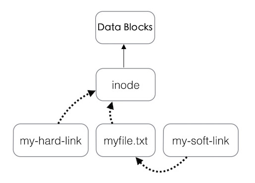

# 基本的 Shell 命令

> **Organization**: 千锋教育 Python 教学部<br>
> **Date** : 2019-08-25<br>
> **Author**: [张旭](mailto:zhangxu@1000phone.com)


## 一、Shell 是个什么鬼

- Kernel

    Kernel 是操作系统的核心，直接与硬件打交道，处理很多底层的事情。

    一般禁止普通用户直接操作，外部程序想要调用内核功能需要使用 “系统调用” 的接口

    ```
        ┌────────────────────────────────┐
        │              User              │
        ├────────────────────────────────┤
        │      Shell    |  Application   │
        │     ┌────────────────────┐     │
        │     │       Kernel       │     │
        │     │    ┌──────────┐    │     │
        │     │    │ Hardware │    │     │
        └─────┴────┴──────────┴────┴─────┘
        \____ ____/
             V
            OS
    ```

- Shell

    Shell 是一个应用程序，它连接了用户和 Linux 内核，让用户能够更加高效、安全、低成本地使用 Linux 内核，这就是 Shell 的本质。

    Shell 一般分为 “用户界面 (GUI)” 和 “命令行 (CLI)” 两种

- 常见的 GUI Shell
    - Gnome
    - KDE
    - Xface
- 常见的 CLI Shell
    - sh: Bourne shell, 史蒂夫·伯恩在贝尔实验室时编写。1978年随Version 7 Unix首次发布。
    - csh: C shell, 比尔·乔伊在加州大学伯克利分校时编写。1979年随BSD首次发布。
    - bash: Bourne-Again shell, 1987年由布莱恩·福克斯为了GNU计划而编写。原先是计划用在GNU操作系统上，但能运行于大多数类Unix系统的操作系统之上，包括Linux 与 MacOS 都将它作为默认shell。是应用最广的 Shell。
    - zsh: Z shell, 名称的含义是 “The last shell you’ll ever need!”，Zsh 对 Bourne shell做出了大量改进，同时加入了其他shell的某些功能，强化了自动补全功能，还加入了插件机制，定制性非常高，功能最为强大。
    - 可以通过 `cat /etc/shells` 查看当前系统安装了哪些 Shell


## 二、Bash 快捷键

- `ctl + f` 前进一个字符
- `ctl + b` 后退一个字符
- `ctl + a` 回到行首
- `ctl + e` 回到行尾
- `ctl + w` 向左删除一个单词
- `ctl + u` 向左删除全部
- `ctl + k` 向右删除全部
- `ctl + y` 粘贴上次删除的内容
- `ctl + l` 清屏


## 三、目录结构

在Windows中经常看到这样的文件路径: `C:\Users\Rich\Documents\test.doc`。这个文件路径表明了文件 test.doc 位于 C 磁盘分区中。

Linux 采用了一种不同的方式, 在路径名中不使用驱动器盘符。
在 Linux 中，你会看到下面这种路径: `/home/Rich/Documents/test.doc`，路径本身并没有提供任何有关文件究竟存放在哪个物理磁盘上的信息。

Linux虚拟目录中比较复杂的部分是它如何协调管理各个存储设备。在Linux PC上安装的第一块硬盘称为根驱动器。根驱动器包含了虚拟目录的核心，其他目录都是从那里开始构建的。

Linux会在根驱动器上创建一些特别的目录，我们称之为挂载点(mount point)。挂载点是虚 拟目录中用于分配额外存储设备的目录。虚拟目录会让文件和目录出现在这些挂载点目录中，然 而实际上它们却存储在另外一个驱动器中。


```
/                系统根目录，通常不会在这里存储文件
 ├── boot        启动目录
 │
 ├── bin         系统二进制目录，存放普通用户级的 GNU 命令
 ├── sbin        系统超级二进制目录，存放管理员级别的 GNU 命令
 ├── usr         资源目录 (User System Resources)
 │   ├── bin     用户二进制目录，存放用户级的 GNU 命令
 │   └── sbin    用户超级二进制目录，存放管理员用户的 GNU 命令
 │   └── local
 │       ├── bin
 │       └── sbin
 │
 ├── opt         第三方开发的程序 (option), 意为"选装"
 │
 ├── dev         设备目录
 │   ├── null    无底洞 (丢弃一切写入其中的数据)
 │   ├── zero    无限 0 数据流 (常用来产生一个特定大小的空白文件, 或安全销毁文件)
 │   ├── shm     内存文件夹
 │   ├── random  随机数发生器
 │   └── urandom 非阻塞的随机数发生器
 │
 ├── etc         系统配置文件目录 (et cetera)
 ├── proc        当前的进程、运行状态信息的目录
 │
 ├── root        管理员家目录
 ├── home        用户的家目录
 │
 ├── media       媒体目录，可移动媒体设备的常用挂载点，一般是系统自动挂载到这里
 ├── mnt         挂载目录，另一个可移动媒体设备的常用挂载点，一般是留给用户手动挂载
 │
 ├── lib         系统库目录，存放系统和应用程序的库文件
 │
 ├── srv         服务目录，存放本地服务的相关文件
 ├── sys         系统目录，存放系统硬件信息的相关文件
 │
 ├── run         运行目录，存放系统运作时的运行时数据
 ├── tmp         临时目录，可以在该目录中创建和删除临时工作文件
 └── var         可变目录，用以存放经常变化的文件，比如日志文件
```


## 四、目录操作

- 绝对路径: `/usr/local/bin`
- 相对路径: `../foo/bar`
- 命令列表

    | Command          | Description                  |
    | ---------------- | ---------------------------- |
    | `pwd`            | 显示当前目录的绝对路径       |
    | `ls ./`          | 显示当前目录的文件           |
    | `ls -l ./`       | 以列表形式显示文件           |
    | `ls -lh ./`      | 以人类有好的方式显示文件列表 |
    | `ls -A ./`       | 显示隐藏文件                 |
    | `cd xxx`         | 切换文件目录                 |
    | `cd -`           | 回到上一次所在位置           |
    | `mkdir abc`      | 创建名为 `abc` 的目录        |
    | `mkdir -p a/b/c` | 创建三层目录结构 `a/b/c`     |


- 练习
    - 创建如下文件夹

        ```bash
        a/
        ├── b/
        │   ├── d/
        │   │   ├── x
        │   │   ├── y
        │   │   └── z
        │   └── e/
        └── c/
            ├── f/
            │   ├── o
            │   ├── p
            │   └── q
            └── g/
        ```

    - 在 `d` 目录中创建 x, y, z 文件, 在 `f` 目录中创建 o, p, q 三个文件
    - 执行:
        1. `mkdir -p a/{b/{d,e},c/{f,g}}`
        2. `touch a/b/d/{x,y,z}`


## 五、文件操作

- 命令列表

    | Command         | Description                                       |
    | --------------- | ------------------------------------------------- |
    | `cp aa ../bb/`  | 将 aa 文件复制到 ../bb 目录                       |
    | `mv aa ../bb`   | 将 aa 文件移动到 ../ 并更名为 bb                  |
    | `rm foo`        | 删除名为 `foo` 的文件                             |
    | `touch abc`     | 在当前文件夹创建一个 `abc` 文件, 如果已存在则跳过 |
    | `ln -s abc def` | 为 abc 文件创建一个软链接                         |

- cp / mv / rm 的通用参数

    - `-i`: 覆盖前提示
    - `-n`: 如果目标文件已存在，则停止操作
    - `-f`: 如果目标文件已存在，则强制操作，覆盖前不提示
    - `-r`: 递归对文件夹执行某操作 (`mv` 不需要 `-r`)

- 重命名

    没有专门的重命名命令，直接只用 `mv` 操作
    例如，将 `abc.txt` 重命名为 `xyz.txt`，则执行 `mv abc.txt xyz.txt`

- ln 命令详解

    

    - 硬链接: `ln 链接源文件 目标位置`
        - 只能在同分区内创建
        - 一个文件的多个硬链接相当于一个文件有多个名字，多个硬链接在磁盘上只占用一个文件的大小
        - 修改硬链接时，所有同源的硬链接都会发生变化

    - 软链接: `ln -s 链接源文件 目标位置`
        - 可以跨越分区创建
        - 内部只记录目标文件的路径，类似于 Windows 下的 “快捷方式”
        - 通过软链接修改文件，源文件也会发生修改


## 六、压缩文件处理

- tar
    - 压缩: `tar -czf abc.tar.gz abc/`
    - 解压: `tar -xzf abc.tar.gz`
    - 参数详解
        - `-c`: 创建压缩包
        - `-x`: 执行解压缩
        - `-z`: 使用 gzip 算法进行压缩或解压
        - `-f`: 用户指定压缩或解压缩的文件名，

- zip
    - 压缩: `zip -r abc.zip abc/`
    - 解压: `unzip abc.zip`
    - 参数详解
        - `-r`: 用于遍历要压缩的目录

- 练习

    将第二小节练习时创建的文件夹分别用 `tar` 和 `zip` 命令进行压缩和解压缩

## 七、查找文件 `find` 命令

1. 用法

    - 查找当前文件夹下全部文件: `find ./`
    - 只查找文件: `find ./ -type f`
    - 只查找目录: `find ./ -type d`
    - 只查找链接: `find ./ -type l`
    - 按名称查找: `find ./ -name '*.py'`
    - 按权限查找: `find ./ -perm 0644`
    - 按大小查找: `find ./ -size +1k -size -5k`
    - 查找后删除: `find ./ -name '*.log' -delete`

2. 练习

    - 查找某文件夹下所有权限为 644 ，且小于 2k 的 python 文件，并删除
