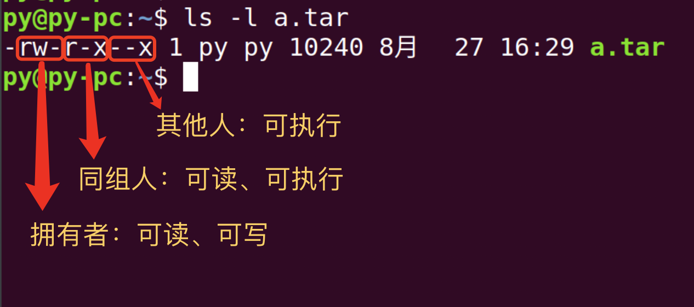

# 用户权限与文本操作

> **Organization**: 千锋教育 Python 教学部<br>
> **Date** : 2019-08-28<br>
> **Author**: [张旭](mailto:zhangxu@1000phone.com)


## 一、Linux 中的用户与组

Linux 是一个多用户系统，为了便于管理多个用户，又产生了用户组。

- 每个用户都有唯一的用户名，并且 Linux 会分配一个唯一的 UID 与之对应。
- 同样每个用户组也有唯一的名称，Linux 会分配一个唯一的 GID 给每一个用户组。
- root 用户的 uid 和 gid 都是 0
- 用户名与 UID 的对应关系记录在 `/etc/passwd` 中。
- 用户组与 GID 的对应关系记录在 `/etc/group` 中。
- 用户的密码信息记录在 `/etc/shadow`

### `passwd` 格式

- 单行样例: `root:x:0:0:root:/root:/bin/bash`
- 详情

    | 列          | 说明                         |
    | ----------- | ---------------------------- |
    | `root`      | 用户名                       |
    | `x`         | 早期曾在此记录密码，现已作废 |
    | `0`         | uid                          |
    | `0`         | gid                          |
    | `root`      | 注释                         |
    | `/root`     | 家目录                       |
    | `/bin/bash` | 登陆后所使用的 Shell         |

### `shadow` 格式

- 单行样例: `root:$1$lrKCOpzq$IHP2BuuKxMdLaBw/:17877:0:99999:7:::`
- 详情:
    | 列                             | 说明                                           |
    | ------------------------------ | ---------------------------------------------- |
    | `root`                         | 用户名                                         |
    | `$1$lrKCOpzq$IHP2BuuKxMdLaBw/` | 密码                                           |
    | `17877`                        | 最后一次修改密码的日期(该数字从1970-1-1开始记) |
    | `0`                            | 密码几日内不可修改(为0表示可以随时修改)        |
    | `99999`                        | 密码有效天数                                   |
    | `7`                            | 密码失效前几天内提醒用户修改密码               |
    |                                | 密码失效的宽限天数                             |
    |                                | 账号失效日期                                   |
    |                                | 保留字段，暂时没用                             |


### `group` 格式

- 单行样例: `wheel:x:10:bob,tom`
- 详情:

    | 列        | 说明             |
    | --------- | ---------------- |
    | `wheel`   | 组名             |
    | `x`       | 组密码（已弃用） |
    | `10`      | 组ID （GID）     |
    | `bob,tom` | 该组的成员       |


## 二、用户管理

### 1. 添加用户

- 用法: `useradd -mU -G 组名 用户名`
- 参数详解:

    - `-G GROUPS`: 新账户的附加组列表
    - `-m`: 在 `/home` 目录创建用户的家目录
    - `-U`: 创建与用户同名的组
    - `-p PASSWORD`: 加密后的新账户密码

### 2. 删除用户

- 用法: `userdel -r 用户名`
- 参数详解:
    - `-r`: 删除主目录和邮件池
    - `-f`: 强制删除该账户

### 3. 修改用户密码

- 用法: `passwd 用户名`

### 4. 切换用户

- 用法1: `su 用户名`: 仅仅切换用户身份

- 用法2: `su - 用户名`: 完全以这个用户进行登录，会初始化当前用户的设置

### 5. 查看用户和组的信息

- 用法1: `id` 查看用户个人的 uid、gid、组信息
- 用法2: `id -u` 查看用户的 uid
- 用法3: `id -g` 查看用户的 gid

## 三、用户组管理

### 1. 添加组

- 用法：`groupadd [选项] 组名`
- 选项:
    - `-g GID`: 为新组使用 GID
    - `-p PASSWORD`: 为新组使用此加密过的密码
    - `-r`: 创建一个系统账户

### 2. 删除组

- 用法: `groupdel 组名`

### 3. 修改用户属性

- 用法: `usermod [选项] 用户名`
- 选项：
    - `-d HOME_DIR`: 用户的新主目录
    - `-g GROUP`: 强制使用 GROUP 为新主组
    - `-G GROUPS`: 新的附加组列表 GROUPS
    - `-a GROUP`: 将用户追加至上边 -G 中提到的附加组中，并不从其它组中删除此用户
    - `-L`: 锁定用户帐号
    - `-m`: 将家目录内容移至新位置 (仅于 -d 一起使用)
    - `-s SHELL`: 该用户帐号的新登录 shell
    - `-U`: 解锁用户帐号

## 四、查看登陆的用户

| 命令      | 说明                                               |
| --------- | -------------------------------------------------- |
| `who`     | 查看谁正在登录                                     |
| `w`       | 查看谁正在登录，并在显示每个登陆用户正在执行的任务 |
| `last`    | 查看历史登陆记录                                   |
| `lastb`   | 查看失败的登陆记录                                 |
| `lastlog` | 查看全部用户最后一次登陆的时间                     |

## 五、文件权限

### 1. 权限的定义

Linux 为文件或目录设置了三种权限:

| 标记 | 含义              |
| ---- | ----------------- |
| r    | read, 读权限      |
| w    | write, 写权限     |
| x    | execute, 执行权限 |

同时又规定了不同身份的用户对该文件的权限，用户身份分三种:

1. user 文件拥有者
2. group 同组人
3. other 其他人

使用 `ls -l` 可以看到文件的权限信息:

```
-rwxr-xr-- 1 bob  staff   9824  8 28 21:22 test.py
-rw-r--r-- 1 tom  staff  10787  8 27 12:57 01.md
-rw-r----- 1 tom  staff   5053  8 28 23:42 sun.jpg
```

最左边一列就是每个文件的权限信息，一共包含 9 个基本权限，分别是 owner / group / others 三种身份各有自己的 read / write / execute 权限。

以 `-rwxr-xr-x` 为例，第一个字符可以忽略，后面的 9 个字符分为三组:

1. `rwx`: 文件拥有者对该文件具有 “读、写、可执行” 的权限
2. `r-x`: 同组人具有 “读、可执行” 的权限，没有写权限
3. `r--`: 其他人只有 “读” 权限

### 2. 权限修改

1. 通过符号修改权限

    

    例如:
    - 设置自己可读可写可执行,同组可读可执行，其他人可执行: `chmod u=rwx,g=rx,o=x test.py`
    - 给自己和同组人增加读写权限: `chmod ug+rw abc.png`
    - 给同组人和其他人删除写权限: `chmod go-w abc.png`
    - 给所有人增加执行权限: `chmod a+x test.py`

2. 通过数字修改权限

    

    例1: `chmod 753 test.py`

    - 身份: 7 / 5 / 3 这三个数字分别对应着 owner / group / others 三个身份
    - 权限值: 将每个数字转成三位二进制数字分别为 `111 / 101 / 011`，与权限对应关系如下表

        | 数字 | 二进制 | 权限  |
        | ---- | ------ | ----- |
        | 7    | `111`  | `rwx` |
        | 5    | `101`  | `r-x` |
        | 3    | `011`  | `-wx` |

    例2:

    - 问题: 将文件权限修改为：自己可读可写，同组可写可执行，其他人可写
    - 答案: `chmod 632 test.py`

### 3. 修改文件拥有者

用法: `chown 用户:组 文件`


## 六、文本操作

- `echo xyz`: 打印文本
- `echo xyz > a.txt`: 将输出的文本重定向到文件a.txt中，a.txt原有内容会被覆盖
- `echo xyz >> a.txt`: 将输出的文本追加到文件a.txt中，a.txt原有内容不会被覆盖
- `cat 文件名`: 查看文件
- `head -n N 文件名`: 查看文件的前 N 行
- `tail -n N 文件名`: 查看文件的后 N 行
- `less 文件`: 快速浏览文件
    - 按 j 向下
    - 按 k 向上
    - 按 f 向下翻屏
    - 按 b 向上翻屏
    - 按 g 到全文开头
    - 按 G 到全文结尾
    - 按 q 退出
- `sort 文本或文件`: 将结果按升序排序
- `sort -r 文本或文件` 将结果按降序排序
- `uniq` 去重, 依赖排序, 常跟在 sort 后面使用
- `awk '{print $N}'`  打印出相关列
- `wc` 字符统计
    - `-c`: 统计字符
    - `-w`: 统计单词
    - `-l`: 统计行
    - 例如: 统计代码行数 `wc -l abc.py`

- 管道符: `|`
    - 管道符可以连接两个命令，将前面的输出作为后面的输入

- 文本过滤 `grep`
    - 参数
        - `-i` 忽略大小写
        - `-I` 忽略二进制文件
        - `-r` 递归查找目录
        - `-n` 打印行号
        - `-c` 只显示匹配到的个数
        - `-l` 只显示匹配到的文件列表
        - `-o` 只显示匹配到的单词
        - `-v` 忽略制定的字段
        - `-E` 通过正则表达式匹配
        - `--include='*.py'` 仅包含 py 文件
        - `--exclude='*.js'` 不包含 js 文件

- 练习: 统计出自己使用的最多的 10 个命令

    - 答案: `history | awk '{print $2}' | sort | uniq -c | sort -gr | head -n 10`


## 七、vim

VIM 是终端下最常用的编辑器，有 “编辑器之神” 之称，简洁而强大！

VIM 分为三种模式：命令模式，插入模式，底栏命令模式

1. 按 esc 键，进入命令模式

    - `h, j, k, l` 光标左、下、上、右移动
    - `ctl + e` 向下滚动
    - `ctl + y` 向上滚动
    - `ctl + f` 向下翻屏
    - `ctl + b` 向上翻屏
    - `yy` 复制整行
    - `yw` 复制整行
    - `p` (小写的p) 粘贴到下一行
    - `P` (大写的P) 粘贴到上一行
    - `dd` 删除整行
    - `d3w` 向前删除3个单词
    - `7x` 删除7个字符
    - `u` 撤销
    - `ctl + r` 重做
    - `c3w` 剪切3个单词
    - `gg` 跳至文件首行
    - `shift + g` 跳至文件结尾
    - `shift + h` 跳至屏幕首行
    - `shift + m` 跳至屏幕中间
    - `shift + l` 跳至屏幕结尾
    - `ctl + v` 列编辑
    - `shift + v` 选中整列
    - `shift + >` 向右缩紧
    - `shift + <` 向左缩紧

2. 按 i 键，进入插入模式

    - 插入模式下正常输入即可
    - 想做其他操作，必须先按 ESC 键回到命令模式

3. 在命令模式时按 : 键，进入底栏命令模式
    - `23` 跳至文件的第 23 行
    - `%s/abc/123/g` 把文件中所有的 abc 替换成 123
    - `set nu` 打开行号
    - `set nonu` 关闭行号
    - `w` 保存
    - `q` 退出
    - `wq` 保存并退出

4. vim 配置文件 `~/.vimrc`

5. 备注

    * <https://coolshell.cn/articles/5426.html>
    * <http://www.oschina.net/question/615783_148433>
    * 我的 vimrc <https://raw.githubusercontent.com/seamile/rc.d/master/vimrc>
