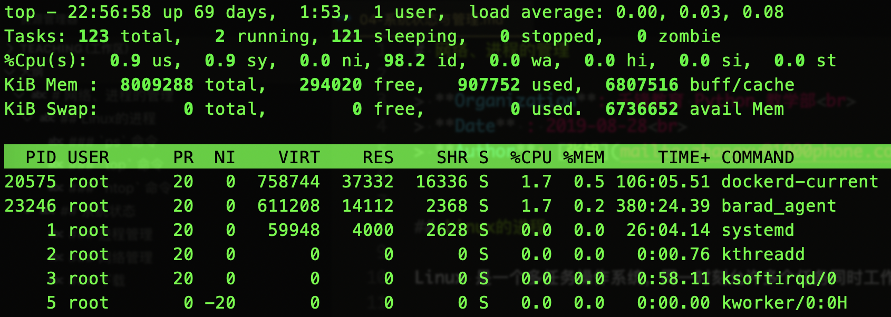
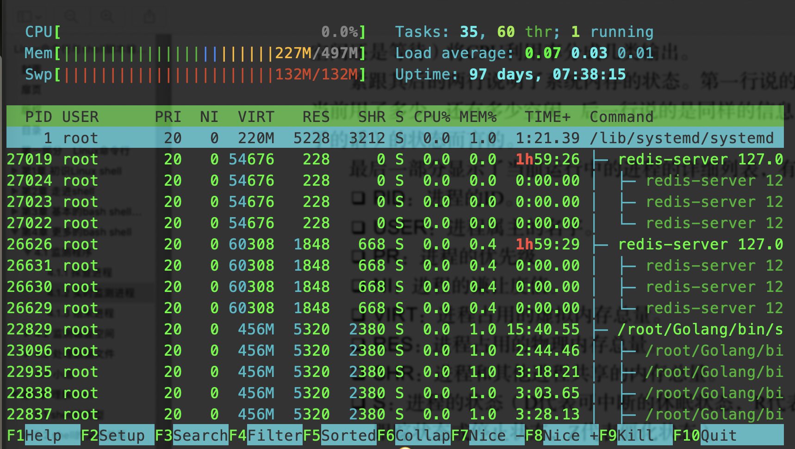

# 系统状态与管理

> **Organization**: 千锋教育 Python 教学部<br>
> **Date** : 2019-08-29<br>
> **Author**: [张旭](mailto:zhangxu@1000phone.com)


## 一、进程状态

Linux 是一个多任务操作系统，同一时刻允许多个任务同时工作，运行中的每一个任务就是一个进程。

查看进程信息常用的命令有 ps 和 top。

### `ps` 命令

`ps` 即 process status 的意思，用来查看进程状态。它显示的是敲下命令后一瞬间的进程状态。

`ps` 不带参数时能看到的信息很少：

```
[root@boss ~]# ps
  PID TTY          TIME CMD
25838 pts/0    00:00:00 bash
27269 pts/0    00:00:00 ps
```

ps命令支持3种不同类型的命令行参数:
- Unix风格的参数，前面加 `-`，如 `ps -ef`
- BSD风格的参数，前面不加 `-`，如 `ps aux`
- GNU风格的长参数，前面加 `--`，如 `ps --pid 123`

ps 命令非常强大，参数也异常丰富，没有必要记住全部，牢记一些常用的参数组合即可

1. `ps -ef`

    ```
    [root@boss ~]# ps -ef
    UID    PID  PPID  C  STIME TTY        TIME  CMD
    root     1     0  0  6月21   ?    00:26:10  /usr/lib/systemd/systemd
    root     2     0  0  6月21   ?    00:00:00  [kthreadd]
    root     3     2  0  6月21   ?    00:00:58  [ksoftirqd/0]
    root     5     2  0  6月21   ?    00:00:00  [kworker/0:0H]
    root     7     2  0  6月21   ?    00:00:21  [migration/0]
    root     8     2  0  6月21   ?    00:00:00  [rcu_bh]
    root    11     2  0  6月21   ?    00:00:36  [watchdog/0]
    ```

    - 参数详解
        - `-e`: 参数指定显示所有运行在系统上的进程
        - `-f`: 参数则扩展了输出

    - 每列详解
        - UID: 启动这些进程的用户。
        - PID: 进程的进程ID。
        - PPID: 父进程的进程号(如果该进程是由另一个进程启动的)。
        - C: 进程生命周期中的CPU利用率。
        - STIME: 进程启动时的系统时间。
        - TTY: 进程启动时的终端设备。
        - TIME: 程序累计占用 CPU 的时间
        - CMD: 进程运行的命令

2. `ps aux`

    ```
    [root@boss ~]# ps aux
    USER PID %CPU %MEM  VSZ   RSS TTY  STAT START   TIME COMMAND
    root   1  0.0  0.0  948  4000 ?    Ss   6月21  26:10 /usr/lib/systemd/systemd
    root   2  0.0  0.0    0     0 ?    S    6月21   0:00 [kthreadd]
    root   3  0.0  0.0    0     0 ?    S    6月21   0:58 [ksoftirqd/0]
    root   5  0.0  0.0    0     0 ?    S<   6月21   0:00 [kworker/0:0H]
    root   7  0.0  0.0    0     0 ?    S    6月21   0:21 [migration/0]
    root   8  0.0  0.0    0     0 ?    S    6月21   0:00 [rcu_bh]
    root   9  0.0  0.0    0     0 ?    S    6月21  66:51 [rcu_sched]
    ```

    - 参数详解
        - `a`: 显示跟任意终端关联的所有进程
        - `u`: 采用基于用户的格式显示
        - `x`: 显示所有的进程，甚至包括未分配任何终端的进程

    - 每列信息
        - `USER`: 执行这个进程的用户
        - `PID`: 进程 ID
        - `%CPU`: 当前进程的 CPU 占用
        - `%MEM`: 当前进程的 内存 占用
        - `VSZ`: 进程占用的虚拟内存大小，以千字节(KB)为单位。
        - `RSS`: 进程占用的物理内存大小
        - `TTY`: 进程启动时的终端设备。
        - `STAT`: 进程状态
        - `START`: 进程启动时刻
        - `TIME`: 程序累计占用 CPU 的时间
        - `COMMAND`: 启动进程的命令

    - 关于 `STAT`
        - 代表当前进程状态的双字符状态码。
        - 第一个字符表明进程状态:
            - `O`: 代表正在运行
            - `S`: 代表在休眠
            - `R`: 代表可运行，正等待 CPU
            - `Z`: 代表僵化，进程已结束但父进程已不存在
            - `T`: 代表停止
        - 第二个参数进一步说明进程的状态细节:
            - `<`: 该进程运行在高优先级上。
            - `N`: 该进程运行在低优先级上。
            - `L`: 该进程有页面锁定在内存中。
            - `s`: 该进程是控制进程。
            - `l`: 该进程是多线程的。
            - `+`: 该进程运行在前台。


### `top` 命令

ps 命令只能查看一瞬间的进程状态，如果想要持续查看某些进程的状态可以使用 top



- 头信息逐行详解:

    1. 系统运行的整体状态: 开机时长，登陆用户数，系统负载
        - 系统负载: `load average: 0.00, 0.02, 0.05`
        - 分别代表: 一分钟负载，五分钟负载，十五分钟负载
        - 负载值越高代表服务器压力越大
        - 负载值不要超过 CPU 的核心数。如果超过核心数意味着有很多进程在等待使用 CPU
        - 与 `uptime` 命令的结果一样 (查看系统状态)
    2. 任务情况: 任务总数，运行中的数量，休眠数量，停止数量，僵尸进程数量
    3. CPU 使用情况:
        - **us**: (user) 用户态占用
        - **sy**: (system) 内核态占用
        - **id**: (idle) 空闲的 CPU
    4. 内存占用情况: 内存总量, 空闲内存, 使用的内存, 缓冲区占用的内存
    5. 交换分区的占用
        - 交换分区是一种将内存数据保存到硬盘的技术，一般在内存不足的时候使用

- 进程区详情:

    - PID: 进程的ID。
    - USER: 进程属主的名字。
    - PR: 进程的优先级。
    - NI: 进程的谦让度值。
    - VIRT: 进程占用的虚拟内存总量。
    - RES: 进程占用的物理内存总量。
    - SHR: 进程和其他进程共享的内存总量。
    - S: 进程的状态 (与 ps 基本相同)。
    - %CPU: 进程使用的CPU时间比例。
    - %MEM: 进程使用的内存占可用内存的比例。
    - TIME+: 自进程启动到目前为止的CPU时间总量。
    - COMMAND: 进程所对应的命令行名称，也就是启动的程序名。

- 小技巧:

    进程太多时，可以通过 -p 参数指定需要查看的进程ID，让进程信息更精简：

    ```
    top -p PID1,PID2,PID3,...
    ```

### `htop` 命令

如果感觉 top 还不够直观，可以使用 `htop`

htop 不是系统默认的命令，需要额外安装

- 安装: `sudo apt install htop`
- 详情

    

## 二、进程的管理

- `kill`: 杀死进程, 或者给进程发送信号
    - `-1  (HUP)`  平滑重启
    - `-9  (KILL)` 强制杀死进程
    - `-15 (TERM)` 正常终止进程 (kill 的默认信号)

- `pkill [ProcessName]`  按名字处理进程

- `killall [MatchedProcessName]`  处理名字匹配的进程


## 三、其他状态

### 1. 内存状态 `free`

```
[root@boss ~]# free
        total    used    free  shared  buff/cache  available
Mem:  8009288  805476  456884   26704     6746928    6838848
Swap:       0       0       0
```

可以通过 `-m` 或 `-g` 参数调整 free 命令显示数值的单位。


### 2. 硬盘

- `iostat`: 查看硬盘写入和读取的状态

- `df -lh`: 查看硬盘分区，及每个分区的剩余空间

- `du -hs ./`: 查看当前目录占用的硬盘大小

### 4. 网络状态

- `ifconfig`  查看网卡状态, 常用来检查自身 IP 地址

- `netstat -natp`  查看网络连接状态
    - `-a`: 显示所有选项
    - `-t`: 显示所有与TCP相关的选项
    - `-u`: 显示所有与UDP相关的选项
    - `-x`: 显示所有与Unix域相关的套接字选项
    - `-n`: 拒绝显示别名，能显示数字的全部转换为数字显示
    - `-p`: 显示建立相关连接的程序名。
    - `-l`: 显示所有状态为Listen的连接
    - `-e`: 显示扩展信息,如当前链接所对应的用户
    - `-c`: 间隔一段时间执行一次netstat命令。
    - `-s`: 显示统计信息。对每种类型进行汇总

- `ping -i 0.5 -c 100 xx.xx.xx.xx`
    - `-i`: 间隔
    - `-c`: 数量
    - `-q`: 安静模式, 只打印结果

- `lsof`
    - `lsof -i :[PORT]` 查看占用端口的程序
    - `lsof -i tcp` 查看所有 TCP 连接
    - `lsof -u abc` 查看用户 abc 打开的所有文件
    - `lsof -p 123` 查看 pid 为 123 的进程打开的所有文件

- 路由追踪: `traceroute [HOST]`

- DNS 查询

    - `dig [DOMAIN]`
    - `host [DOMAIN]`
    - `nslookup [DOMAIN]`

### 5. 时间和日期

- `date`: 查看日期与时间
    - 可以通过 `+` 指定显示的格式: `date +%Y-%m-%d` (**加号后面紧跟格式, 不要有空格**)
    - 支持的时间格式字段:
        - **`%H`**: 小时，24小时制（00~23）
        - **`%I`**: 小时，12小时制（01~12）
        - **`%k`**: 小时，24小时制（0~23）
        - **`%l`**: 小时，12小时制（1~12）
        - **`%M`**: 分钟（00~59）
        - **`%p`**: 显示出AM或PM
        - **`%r`**: 显示时间，12小时制（hh:mm:ss %p）
        - **`%s`**: 从1970年1月1日00:00:00到目前经历的秒数
        - **`%S`**: 显示秒（00~59）
        - **`%T`**: 显示时间，24小时制（hh:mm:ss）
        - **`%X`**: 显示时间的格式（%H:%M:%S）
        - **`%Z`**: 显示时区，日期域（CST）
        - **`%a`**: 星期的简称（Sun~Sat）
        - **`%A`**: 星期的全称（Sunday~Saturday）
        - **`%h, %b`**: 月的简称（Jan~Dec）
        - **`%B`**: 月的全称（January~December）
        - **`%c`**: 日期和时间（Tue Nov 20 14:12:58 2012）
        - **`%d`**: 一个月的第几天（01~31）
        - **`%x, %D`**: 日期（mm/dd/yy）
        - **`%j`**: 一年的第几天（001~366）
        - **`%m`**: 月份（01~12）
        - **`%w`**: 一个星期的第几天（0代表星期天）
        - **`%W`**: 一年的第几个星期（00~53，星期一为第一天）
        - **`%y`**: 年的最后两个数字（1999则是99）

- `cal`: 查看日历
    - `-1`: 查看本月的日历
    - `-3`: 查看最近三个月的日历
    - `-y`: 查看全年的日历


### 6. 下载

- `curl`:
    - 仅执行 HTTP 访问: `curl http://example.com/`
    - 下载: `http://example.com/foo/bar/xxx.zip > ./xxx.zip`

- `wget`: 下载 `wget http://example.com/foo/bar/xxx.zip`

- `scp`:
    - 从服务器下载到本地: `scp root@x.x.x.x:/root/abc ./abc`
    - 从本地上传到服务器: `scp ./abc root@x.x.x.x:/root/abc`
